# Dive into pycode
---
## Описание

Do you know python bytecode well good? It's time to show your skill

### Файлы таска
[**runner.py**](runner.py) (MD5: 5f258c079c4accd789a6ea26f4c58ffe) - запуск таска

[**Shuffle.pyc**](Shuffle.pyc) (MD5: 196e859c79a612185d12b09930e2a82b) - проверка ключа, расшифровка флага

---

## WriteUp

### Инструменты для решения
1. Любой **hex-редактор**. В данном случае очень хорошо подходит [**010editor**](https://www.sweetscape.com/), так как есть соответствующий парсер для **pyc**
файла **Python** версии **2.7**.
2. **Декомпиллятор** для байткода питона (с возможностью выводить инструкции
байткода - тот же [**pycdas**](https://github.com/zrax/pycdc))
3. **Python 2.7**

### Инструкция
Основным файлом является [**Shuffle.pyc**](Shuffle.pyc), где реализована проверка ключа и
непосредственно расшифровка флага. **Байткод** программы собран таким образом, чтоб
сразу не дать возможность преобразовать в исходный код, поэтому **задача сводится
к анализу инструкций байткода и восстановлению правильной структуры программы**
для декомпиляции.

### Решение
При запуске скрипта [**runner.py**](runner.py), который в свою очередь запускает наш
основной файл [**Shuffle.pyc**](Shuffle.pyc), запрашивается ключ **(в 16-ричном формате)** для расшифровки флага:

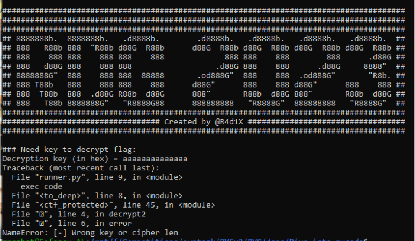

Смотрим запускающий скрипт [**runner.py**](runner.py):

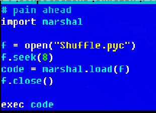

В данном случае никакой полезной информации для решения данный скрипт не
дает.
Анализируем файл [**Shuffle.pyc**](Shuffle.pyc). C помощью стандартной утилиты **file** можно понять, что перед нами скомпилированный питоновский код версии 2.7:

```sh
> file Shuffle.pyc
Shuffle.pyc: python 2.7 byte-compiled
```

Попытки декомпиляции приводят к неудаче из-за наличия в байткоде неверныx инструкций **(opcode)**:

```sh
> pycdc Shuffle.pyc
# Source Generated with Decompyle++
# File: Shuffle.pyc (Python 2.7)

Unsupported opcode: <255>
# WARNING: Decompyle incomplete
>
```
Открываем файл в **hex-редакторе** (в данном случае использовался **hiew**).
Первый взгляд на **raw-данные** дает понять о том, что перед нами либо
зашифрованные, либо сжатые данные (так как имеют достаточно беспорядочную
структуру; чаще всего, если полезные данные ничем не обработаны, то можно
отследить некоторую зависимость – в части это касается байткода или
ассемблерного кода):

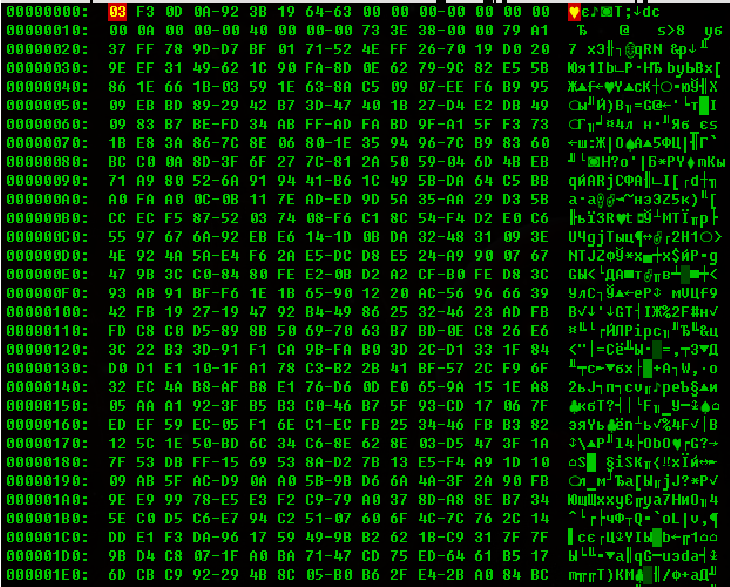

Ради примера можно сравнить с необработанным байткодом:

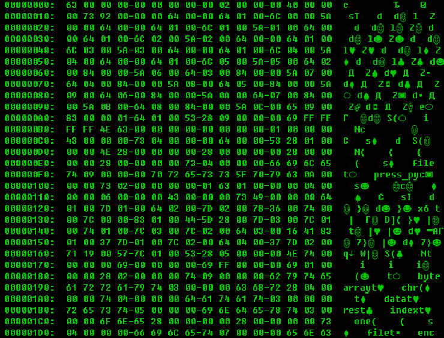

Отследим наличие строк в данном **pyc-файле**. Согласно структуре **pyc-файла**
(не важно какой версии питона) [[ссылка](https://www.sweetscape.com/010editor/repository/files/PYC.bt)], все константы, переменные, строки,
импортируемые библиотеки, используемые в ходе выполнения, помещаются в конце
**pyc-файла** (то есть сразу после инструкций байткода):

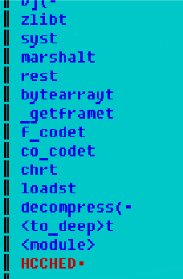

Видим знакомые **[по крайней мере данная информация легко гуглится]**
библиотеки и вызова, что дает нам понять, что в программе происходит работа со
сжатыми данными **(библиотека zlib, decompress)** и байткодом **(библиотека marshal,
f_code, co_code, load)**.
Так как непосредственная декомпиляция **pyc-файла** не помогла, то стоит
попробовать обратиться к выводу инструкций байткода **(c помощью pycdas [идет
вместе с декомпилятором pycdc])**. Также парсинг инструкции байткода легко
сделать самому, так как соответствующий инструментарий встроен в **python** в виде
отдельных библиотек **(например, dis)**:

```sh
> pycdas Shuffle.pyc > Shuffle.pycasm
>
```

Перенаправляем вывод в файл **Shuffle.pycasm** для более удобного анализа
(вывод будет достаточно большим).
Смотрим полученный листинг инструкций байткода. Выполнение кода
происходит непосредственно с самого начала блока байткода **(в данном случае с
инструкции SETUP_EXCEPT)**:

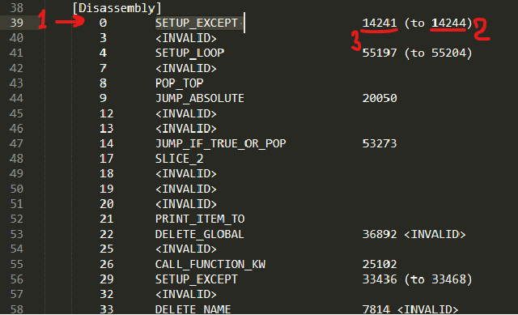

1. – текущий **offset** инструкции **(в данном случае SETUP_EXCEPT)** в блоке кода
2. – указывает на **offset** инструкции, куда перейдет управление программы в случае
появления исключения **(для удобства вычислен дизассемблером pycdas)**
3. – **offset** до инструкции; показывает фактическое смещение вперед от текущий
инструкции без учета размера самой инструкции **(стандартный размер SETUP_EXCEPT
в Python 2.7 = 3 байта)**.

Таким образом данная инструкция даёт нам понять, что если далее в коде
произойдет ошибка, то ход выполнения программы перейдет на инструкцию с **offset-
ом 14244**.

Как видим, следующий **opcode** является некорректным - **\<INVALID\>**, что
соответствует байту **0xff (2)** согласно байтам инструкций:

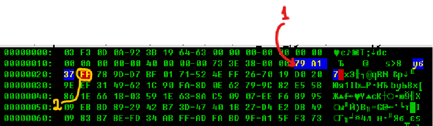

1. – начало блока байт кода. Первая инструкция SETUP_EXCEPT (3 байта = 0x79
0xA1 0x37)
2. – **\<INVALID\>** инструкция<br>
Эта инструкция и вызвала ошибку при попытке декомпилировать код.

Понимаем, что эта инструкция также вызовет ошибку в ходе выполнения
программы и управление перейдет к инструкции с **offset-ом 14244**. Смотрим какой
код там расположен:

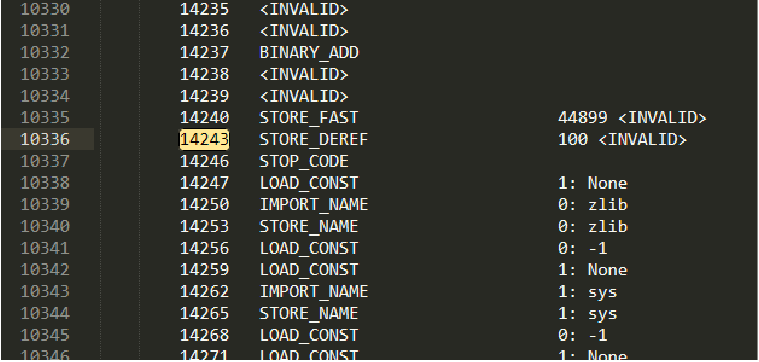

Видим, что декомпилятор некорректно отобразил инструкции байткода в этой
области и поэтому инструкции на **offset-е 14244** нет (это связано с наложением
инструкций разного размера друг на друга). С помощью **hex-редактора** пропатчим
эту область таким образом, чтоб дизассемблер отобразил корректные инструкции:
(От начала байткода в **pyc-файле [offset = 0x1E] отсчитываем 14244 байт [0x1E +
14244 = 0x37C2]**)

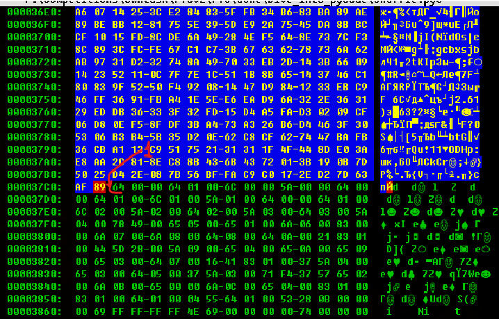

1 – нужный **offset** и начало (**байт 0x64**) корректной инструкции. А предыдущий
байт **0x89** как раз обозначает ту самую некорректную в текущем контексте
инструкцию **STORE_DEREF**, которая занимает 3 байта (**0x89 0x64 0x00**) – то есть
произошло наложение инструкций. Для исправления достаточно затереть байт **0x89**
на **0x09** (**эквивалентно инструкции NOP**).

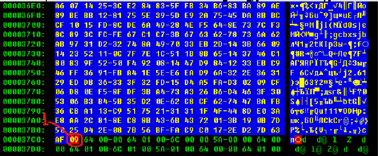

Примечание:
Узнать байт инструкции, соответствующей её текстовому формату, можно из
встроенной библиотеки **dis**:

```sh
Python 2.7.18 (default, Mar 8 2021, 13:02:45)
[GCC 9.3.0] on linux2
Type "help", "copyright", "credits" or "license" for
>>> import dis
>>> dis.opmap["RETURN_VALUE"]
83
>>> hex(dis.opmap["RETURN_VALUE"])
'0x53'
>>> hex(dis.opmap["NOP"])
'0x9'
>>> hex(dis.opmap["STORE_DEREF"])
'0X89'
>>>
```
Пробуем заново дизассемблировать код и смотрим на **offset 14244**:

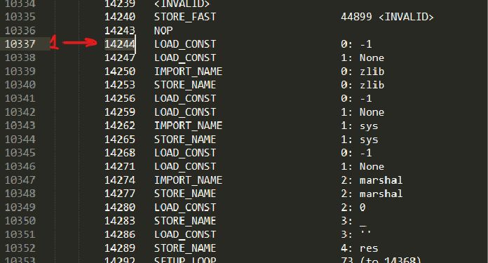

Как видно, теперь листинг выглядит правильно.

Проанализировав дальнейшие инструкции байткода видим, что некорректных
**opcode-ов** нет, поэтому имеет смысл скопировать данный фрагмент байткода и
собрать новый **pyc-файл**, и декомпилировать.

Стоит отметить, что в данном случае легче будет все-таки затереть верхний
кусок **(начиная с самого начала, то есть инструкции SETUP_EXCEPT)** некорректного
байткода байтами **0x09 (инструкция NOP)**. Простота обосновывается тем, что не
придется изменять **header-ры** байткода (перед байткодом указывается размер этого
кода).

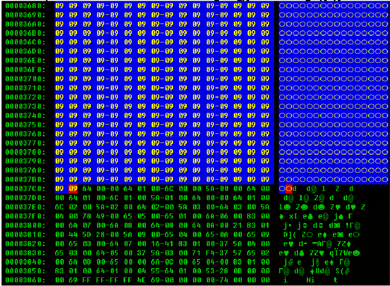

При этом запомнили, что данные скорее всего сжаты/зашифрованы, поэтому
придется после к ним вернуться.

Полученный пропатченный **pyc** код пробуем декомпилировать.<br>Видим, что
декомпиляция прошла успешно и далее можем проанализировать исходный код:

```python
> pycdc Shuffle_patched.pyc
# Source Generated with Decompyle++
# File:Shuffle_patched.pyc (Python 2.7)

import zlib
import sys
import marshal
_ = 0
res = ''
for __ in bytearray(sys._getframe().f_code.co_code[4:14244]):
  res += chr(__ ^ _ % 255)
  _ += 1

exec marshal.loads(zlib.decompress(rus))
>
```

По итогу понимаем, что те данные, который мы затерли, действительно
являются зашифрованными и сжатыми.

Если кратко, то команда **sys._getframe().f_code.co_code[4:14244]**
извлекает данные из текущего блока байткода.

После расшифровки данных мы получаем еще один скомпилированный
питоновский файл **(в дальнейшем будет упоминаться с именем payload)**, только
большего размера и **без pyc header-ра**.

Также пробуем декомпилировать полученный файл, предварительно приделав
корректный **pyc-header питона 2.7**.

```sh
> cat pyc2.7header.bin payload > payload.pyc
>
```

```sh
> pycdc payload.pyc
# Source Generated with Decompyle++
# File: payload.pyc (Python 2.7)

Segmentation fault (core dumped)
>
```
Получаем ошибку при декомпиляции.

Оценим строки полученного файла:

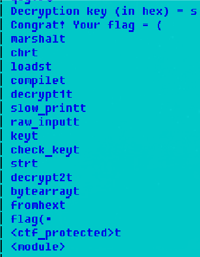

По смыслу строк понимаем, что именно тут происходит вся полезная работа
программы.

Пробуем дизассемблировать и, как в предыдущем случае, начинаем
анализировать с начала блока байткода:

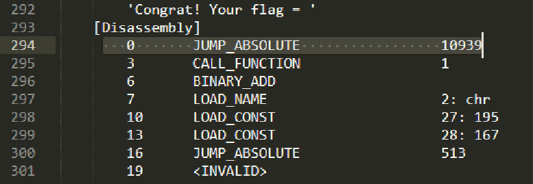

Сразу происходит прыжок хода выполнения программы на инструкцию с
**offset-ом 10939**.<br> 
Смотрим:

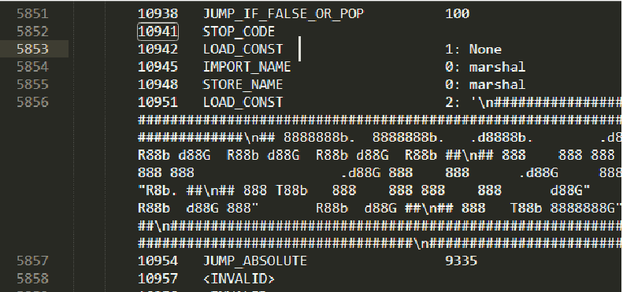

Как видим, опять произошло наложение инструкций и offset-а 10939 нет.
<br>Патчим:

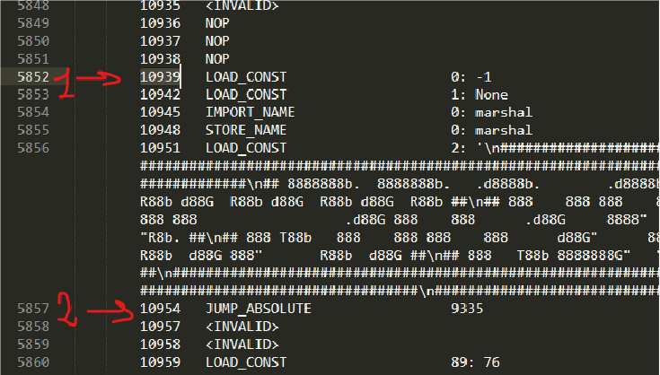

После выполнения кусочка байткода, видим опять прыжок на конкретный
**offset**. После нескольких таких попыток проследовать за ходом выполнения
программы понимаем, что по факту изначальный байткод просто разбит на небольшие
фрагменты, которые соединены инструкциями **JUMP_ABSOLUTE**. С этого момента по
факту задача сводится к написанию небольшого скрипта, который соберет данные
фрагменты инструкций в один последовательный блок **(убрав при этом все
JUMP_ABSOLUTE инструкции)**. Далее на основе полученного цельного байткода
формируем новый **pyc-файл**, который можем успешно декомпилировать (по факту в
**header-ах pyc-кода** меняем только значения размера байткода, а остальные части
**pyc-файла** – переменные, строки, константы и т.п. оставляем там же, где они и
должны быть – в конце pyc-а и никаких изменений туда вносить не нужно)

Полученный pyc декомпилируем:

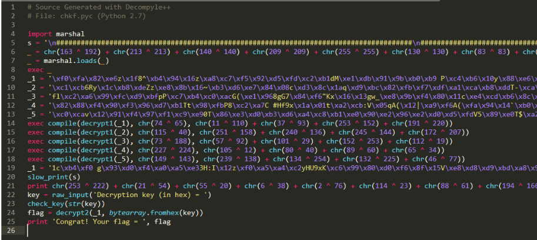

На первый взгляд выглядит достаточно запутано, но работу облегчает то,
что этот код можно выполнять в таком виде в каком он есть и очень просто
избавиться от «усложняющих» конструкций.

По ходу работы понимает, что зашифрованные строки представляют собой
непосредственно исходные коды функций, используемых в программе.

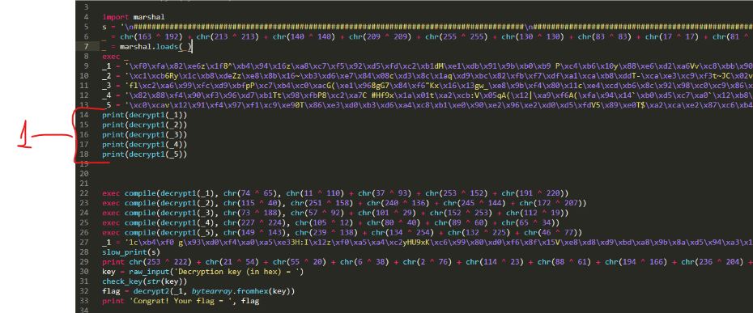

Находим нужную функцию **decrypt2** (по ходу вывода будет понятно, что она
определяется в **_5**).

Шифр достаточно простой и из работы функции понимаем, что нам даже
необязательно понимать, как он работает, лишь стоит убрать лишнюю проверку
ключа (так как очевидно ключ вычисляется из шифртекста, судя из контекста).

**По итогу получаем значения флага**

### Flag

RDGCTF{shUf1l3_PyC0d3_7c429b36}

---

# Ссылки

[Структура pyc файла (версия 2.7)](https://www.sweetscape.com/010editor/repository/files/PYC.bt)

[Компиляция дебаг версии питона](https://pythonextensionpatterns.readthedocs.io/en/latest/debugging/debug_python.html)

[Включение дебаг режима в скрипте](https://fedoraproject.org/wiki/Features/DebugPythonStacks#Verify_LLTRACE)

[Информация об инструкциях байткода питона (версия 2.7)](https://docs.python.org/2.7/library/dis.html#python-bytecode-instructions) 
