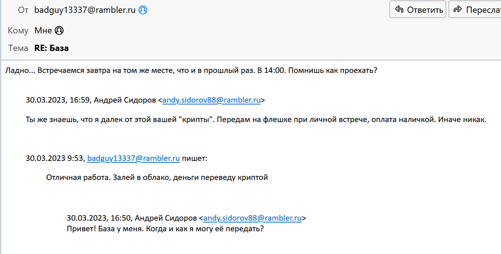
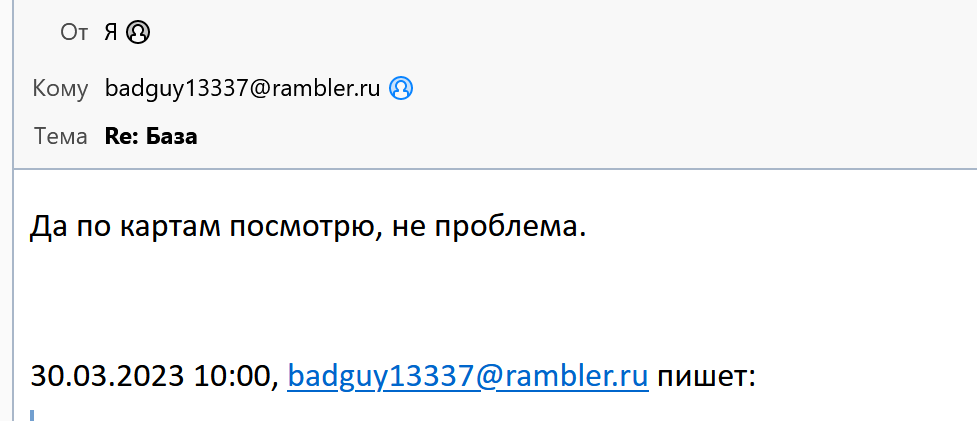
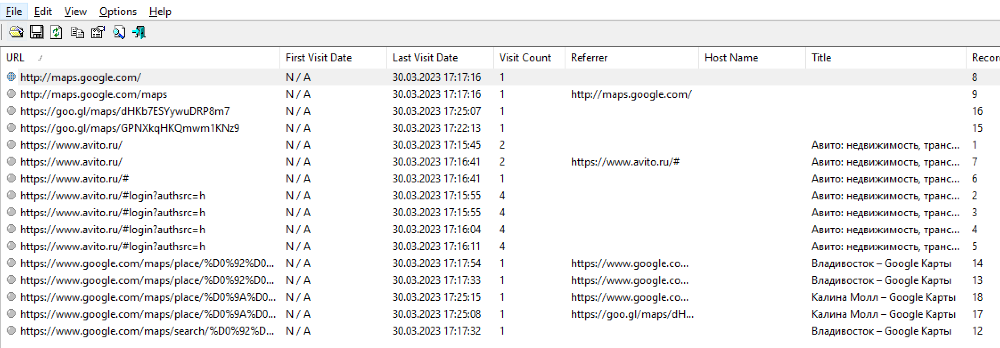
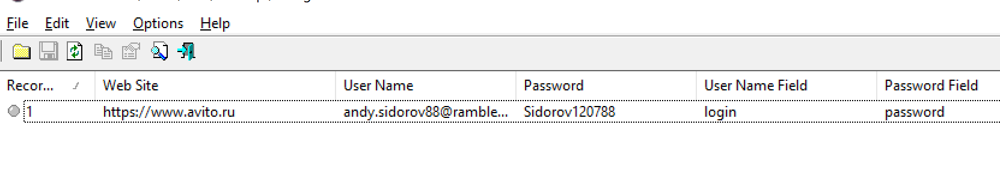
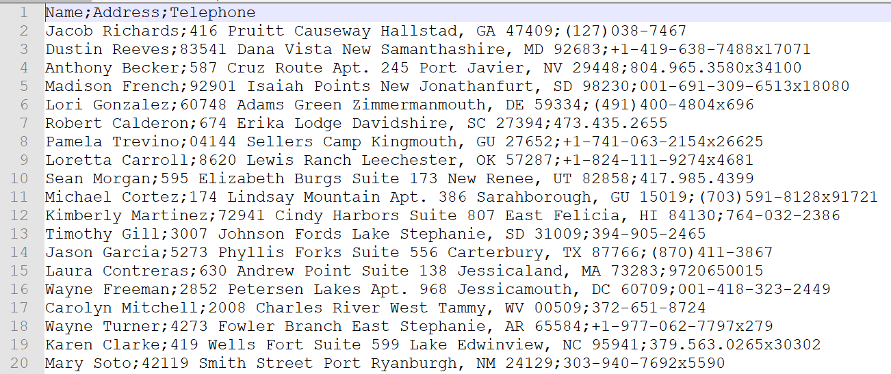
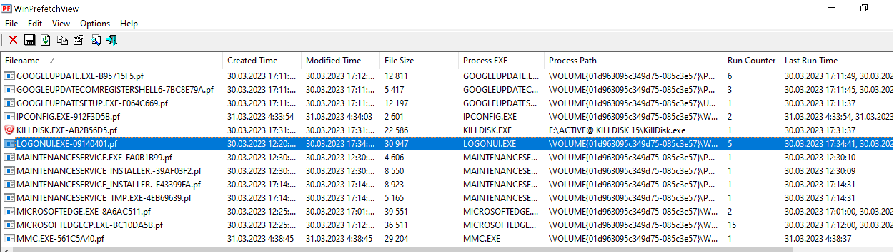

# Corporate Spying. Uncovering the Customer Database Leak

## Участникам

### Легенда

Сотрудник одной крупной компании предположительно слил базу данных постоянных клиентов для перепродажи конкурентам. Сейчас подозреваемый задержан. Перед задержанием он уничтожил данные на флеш-накопителе. Наши специалисты говорят, что восстановить их не представляется возможным. Для дальнейшего исследования вам передана копия диска его ноутбука. Необходимо найти все артефакты, связанные с кейсом.

### Задачи

1. Узнать контактные данные заказчика. Формат ответа: RDGCTF{email_address}
2. Узнать предполагаемое место встречи для передачи краденных данных. Название места указывать в нижнем регистре, на английском языке и без пробелов: RDGCTF{someplace}
3. Найти копию скомпрометированной базы клиентов. Формат ответа: RDGCTF{sha1}, где sha1 - хеш-сумма от файла базы
4. Узнать какое ПО он использовал для уничтожения данных с флеш-накопителя. Название ПО указывать в нижнем регистре и без пробелов: RDGCTF{software.exe} 

## Организаторам

### Hints
- (Flag 3) Попробуйте составить словарь из паролей, используемых пользователем в другом программном обеспечении
- (Flag 4) Windows содержит множество артефактов, указывающих на запуск исполняемых файлов 

### Writeup

Нам дан raw-образ от некоторой системы. Воспользуемся одним из криминалистических инструментов для анализа образов ([Autopsy](https://www.autopsy.com/), [FTK Imager](https://www.exterro.com/ftk-imager) и др.). Мой выбор пал на FTK Imager. 

После добавления образа в дерево доказательств видим один раздел, отформатированный в файловую систему NTFS. Файловая структура специфична для операционной системы семейства Windows. Судя по содержимому каталога /Users в системе присутствует один активный пользователь - a.sidorov. Из установленного программного обеспечения (Program Files/) стоит выделить следующее:

- Mozilla Thunderbird - популярный почтовый клиент
- Mozilla Firefox - не менее популярный веб-браузер
- VeraCrypt - решение для создание криптоконтейнеров

А теперь перейдем к решению поставленных задач.

**Узнать контактные данные заказчика.**
Формат предполагаемого флага указывает на то, что контакт имеет вид адреса электронной почты. Давайте ознакомимся с содержимым почтового клиента Thunderbird. Пользовательские настройки для данного почтового клиента хранятся в так называемом профиле. Стандартное расположение для профилей следующее - /Users/{username}/AppData/Roaming/Thunderbird/Profiles/*. В нашем случае полный путь до искомой директории будет иметь вид:
*/Users/a.sidorov/AppData/Roaming/Thunderbird/Profiles/i98if62i.default-release*

Для просмотра содержимого можно воспользоваться различным программным обеспечением. Например, если вы используете Autopsy, то он уже содержит в себе встроенный модуль для данных целей. 
Самый простой вариант - загрузить восстановленный профиль в установленный дистрибутив Thunderbird. Подробнее об этом [здесь](https://support.mozilla.org/en-US/kb/using-multiple-profiles). 

Восстанавливаем содержимое директории с профилем. Загружаем профиль в Thunderbird. После изучения переписки подозреваемого находим адрес сообщника. Флаг RDGCTF{badguy13337@rambler.ru}.

**Узнать предполагаемое место встречи для передачи краденных данных.**
Ранее мы узнали, что между участниками переписки планировалась некая встреча. Также в переписке можно найти небольшую подсказку:

Проанализируем историю веб-браузера Firefox, где пользователь мог искать расположение места встречи. Пользовательские настройки также как и в случае Thunderbird хранятся в профиле. Восстанавливаем профиль для пользователя a.sidorov из следующего расположения:
*/Users/a.sidorov/AppData/Roaming/Mozilla/Firefox/Profiles/8ddng1hu.default-release*

Для парсинга воспользуемся инструментом [Mozilla History View](https://www.nirsoft.net/utils/mozilla_history_view.html) от NirSoft. После запуска выбираем базу *places.sqlite* в восстановленной директории с профилем и получаем список посещенных веб-ресурсов. Также для просмотра можно воспользоваться любым SQLite Viewer.

Видим, что в списке фигурирует картографический сервис Google Maps и лишь одно конкретное расположение. Флаг - RDGCTF{kalinamall}

**Найти копию скомпрометированной базы клиентов.**
Вспоминаем про установленный VeraCrypt. К счастью, криптоконтейнер не так сложно найти. Он находится на рабочем столе пользователя (/Users/a.sidorov/Desktop/Protected). На это указывают метаданные файла, а также высокая степень энтропии его содержимого. Autopsy по умолчанию подсвечивает такие подозрительные файлы. Как получить доступ к содержимому криптоконтейнера? Можно попытаться провести атаку методом полного или словарного перебора. В качестве словаря лучше использовать пароли пользователя, который он использует для других сервисов. 

Попробуем поискать сохраненные пароли в Firefox. Воспользуемся программным обеспечением [PasswordFox](https://www.nirsoft.net/utils/passwordfox.html) от NirSoft. Указываем путь до восстановленного ранее профиля и находим сохраненный пароль от сервиса Avito:

По тому же принципу можно восстановить пароль из Thunderbird.  Указываем путь до восстановленного криптоконтейнера и вводим полученный пароль в интерфейсе Veracrypt. К счастью для нас, пользователь использует один и тот же пароль для разных сервисов. В примонтированном разделе находим один файл clients.csv. 

Берем SHA1-хеш от файла и получаем флаг. RDGCTF{CE3081630024271571ACB86CFFD2C31202457BE7}

**Узнать какое ПО он использовал для уничтожения данных с флеш-накопителя.**
При анализе установленного ПО не удалось обнаружить специализированных инструментов для безопасного удаления данных с носителей. Однако в операционных системах семейства Windows есть весьма много источников, которые могут указывать на факт запуска исполняемых файлов (Prefetch, Amcache, Shimcache и др.). 
Для примера проанализируем Prefetch. Данный механизм используется операционной системой для повышения производительности при запуске приложений. Связанные артефакты расположены по следующему пути: C:\\Windows\\Prefetch\\. Восстанавливаем все файлы с расширением pf в отдельную директорию.
Для анализа воспользуемся инструментом [WinPrefetchView](https://www.nirsoft.net/utils/win_prefetch_view.html) от NirSoft. Указываем путь до директории с восстановленными файлами (Options - Advanced Options - Prefetch Folder) и анализируем перечень запущенного программного обеспечения. 

В глаза бросается ПО [KillDisk](https://www.killdisk.com/eraser.html), которое используется для "полного" удаления данных с различных накопителей. Флаг RDGCTF{killdisk.exe}

### Flags

- (Flag 1) RDGCTF{badguy13337\@rambler.ru}
- (Flag 2) RDGCTF{kalinamall}
- (Flag 3) RDGCTF{CE3081630024271571ACB86CFFD2C31202457BE7}
- (Flag 4) RDGCTF{killdisk.exe}