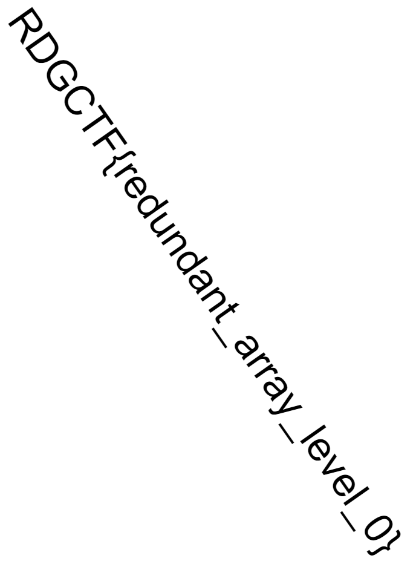
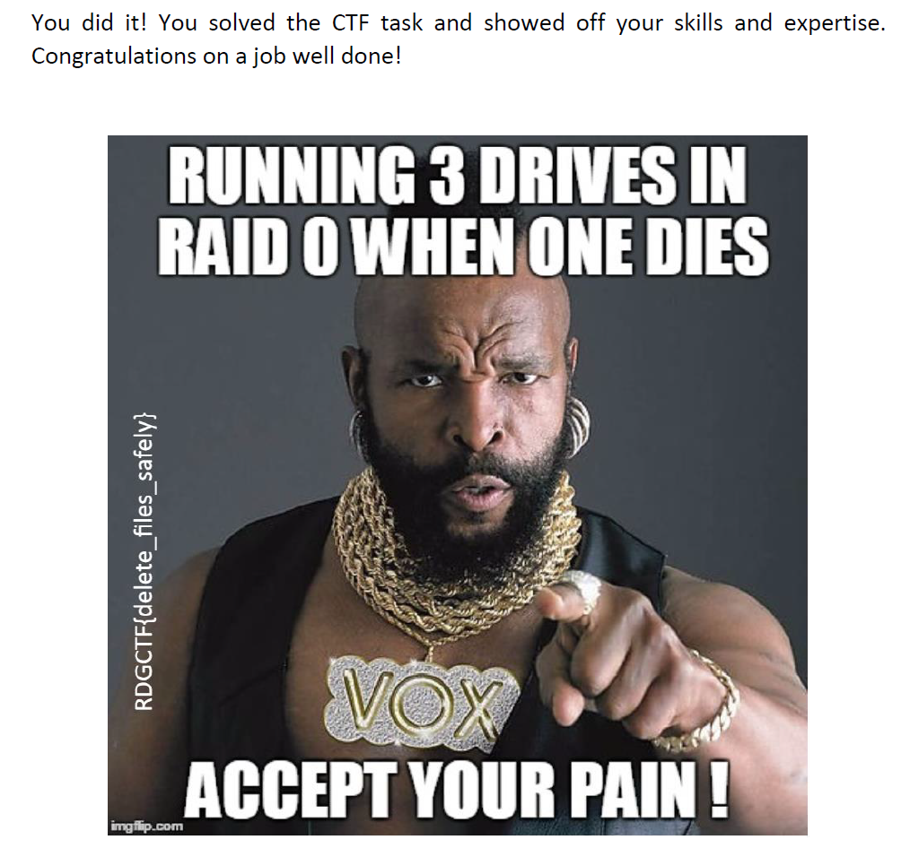

# RAID Rescue. Recovering Valuable Data After a Disk Failure

## Участникам

### Легенда

На компьютере произошел сбой жесткого диска, что привело к потере ценных данных. Диски были объединены в RAID-массив. К счастью, образа жестких дисков были восстановлены, но данные по-прежнему недоступны.

### Задача

Необходимо восстановить потерянные данные. Таск содержит в себе два флага.

## Организаторам

### Hints

- (Flag 1) Используй встроенные в диструбутив утилиты для работы с RAID для его сборки
- (Flag 2) Используй инструменты для карвинга данных

### Writeup

Нам даны образы от трех дисков, входящих в рейд-массив. В первую очередь посмотрим конфигурацию рейда с помощью утилиты [*mdadm*](https://linux.die.net/man/8/mdadm). Данная утилита идет в составе всех основных Linux-дистрибутивов. Выполним следующую команду для извлечения метаданных одного из образов:
```bash
$ mdadm --examine ~/image1.raw

       Magic : a92b4efc
        Version : 1.2
    Feature Map : 0x0
     Array UUID : de344987:af39377e:24aafba2:59f35407
           Name : kali:0  (local to host kali)
  Creation Time : Sun Mar 26 04:05:38 2023
     Raid Level : raid0
   Raid Devices : 3

 Avail Dev Size : 260096 sectors (127.00 MiB 133.17 MB)
    Data Offset : 2048 sectors
   Super Offset : 8 sectors
   Unused Space : before=1968 sectors, after=0 sectors
          State : clean
    Device UUID : 225e24b0:deb8fcc4:7c356cd7:44b335ed

    Update Time : Sun Mar 26 04:05:38 2023
  Bad Block Log : 512 entries available at offset 8 sectors
       Checksum : c477e6bd - correct
         Events : 0

     Chunk Size : 8K

   Device Role : Active device 0
   Array State : AAA ('A' == active, '.' == missing, 'R' == replacing)

```
На выходе получаем много полезной информации: тип RAID (**Raid Level**), количество устройств в массиве (**Raid devices**), смещение данных (**Data offset**), размер блока (**Chunk Size**) и прочие метаданные. 

Эти параметры могут пригодиться при ручной сборке RAID с помощью различных программных решений.  В данном случае нам интересно, что все три диска являются частью массива с типом **RAID 0** (Striping/Чередование). Массивы данного типа не обеспечивают резервирование данных, но позволяют увеличить производительность в ходе чтения файлов. В то же время увеличиваются риски потери данных при выходе одного из устройств, что и произошло по легенде таска.

Если вы попытаетесь восстановить данные из каждого образа, то в данном случае получите лишь фрагменты файлов. Поэтому необходимо собрать массив. Для начала свяжем файлы образов с блочными-устройства с помощью утилиты [*losetup*](https://linux.die.net/man/8/losetup):
```bash
$ sudo losetup /dev/loop11 image1.raw
$ sudo losetup /dev/loop12 image2.raw
$ sudo losetup /dev/loop13 image3.raw
```
Указанные устройства могут быть уже заняты в вашем случае, поэтому при необходимости используйте другие loop-устройства. Теперь соберем массив с с помощью все той же утилиты *mdadm*:

```bash
$ sudo mdadm --assemble /dev/md0 /dev/loop11 /dev/loop12 /dev/loop13
mdadm: /dev/md0 has been started with 3 drives.
```
Монтируем устройство /dev/md0:
```
$ sudo mkdir /mnt/mpoint && sudo mount /dev/md0 /mnt/mpoint
```
После перехода в соответствующее расположение находим первый флаг (image.png) и ряд других ненужных файлов:


Но согласно условиям таска есть и второй флаг. Попробуем покарвить содержимое устройства на предмет удаленных файлов. Воспользуемся инструментом [foremost](https://linux.die.net/man/1/foremost):
```bash
$ sudo foremost -t all -i /dev/md0 -v -o ~/foremost_output

Foremost version 1.5.7 by Jesse Kornblum, Kris Kendall, and Nick Mikus
Audit File

Foremost started at Sun Mar 26 05:50:35 2023
Invocation: foremost -t all -i /dev/md0 -v -o /home/kali/raid/foremost2 
Output directory: /home/kali/raid/foremost2
Configuration file: /etc/foremost.conf
Processing: /dev/md0
|------------------------------------------------------------------
File: /dev/md0
Start: Sun Mar 26 05:50:35 2023
Length: 381 MB (399507456 bytes)
 
Num      Name (bs=512)         Size      File Offset     Comment 

0:      00032770.jpg          67 KB        16778240      
1:      00033014.jpg          39 KB        16903168      
2:      00032906.png          53 KB        16847872       (688 x 932)
**3:    00540677.jpg          87 KB       276826707      
4:      00540674.pdf         282 KB       276825088      
**|
Finish: Sun Mar 26 05:50:48 2023

5 FILES EXTRACTED

jpg:= 3
png:= 1
pdf:= 1
------------------------------------------------------------------

Foremost finished at Sun Mar 26 05:50:48 2023
```

Помимо уже доступных ранее файлов в явном виде удалось восстановить некий pdf-файл. После его открытия получаем второй флаг:



### Flags

- (Flag 1): RDGCTF{redundant_array_level_0}
- (Flag 2): RDGCTF{delete_files_safely}