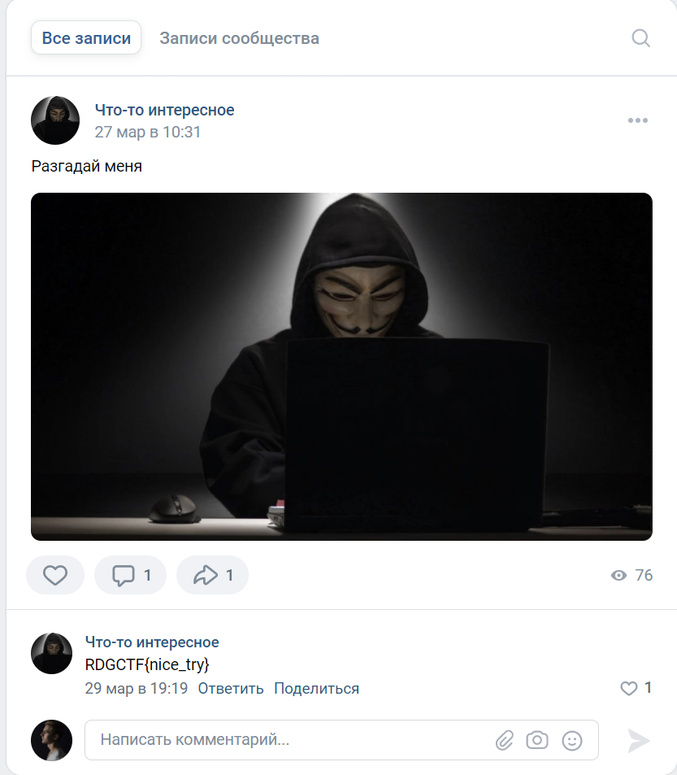
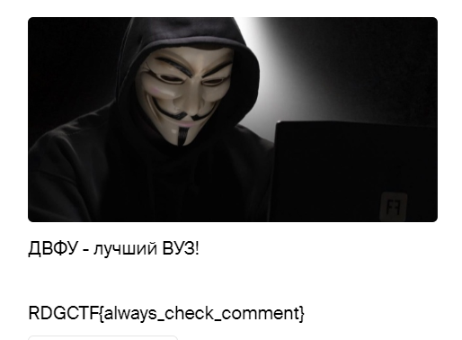
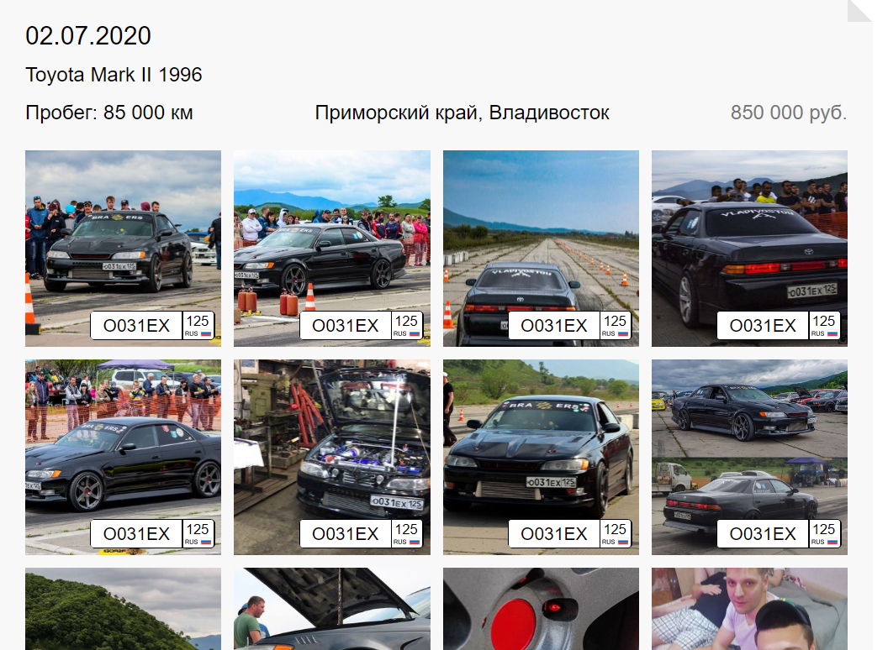

# Внимание! Все таски разобраны в одном файле
---
# Tasks
---
## Послание

[Task1](task1.txt)

### Hint
Вас кодированию учили?

### WriteUp
в последней строчке хекс ведет на [VK](https://vk.com/club192816620), там есть пост, если его открыть то в комментарии к фото будет флаг.

### Flag

RDGCTF{nice_try}

---

## ДВФУ

ДВФУ лучший вуз?

### Hint

Может воспользуешься 2gis?

### WriteUp

В 2gis находим ДВФУ, и смотрим отзывы

### Flag
RDGCTF{always_check_comment}

---

## Путь Героя
43.09042498204016, 131.9230333056536

Серый воин со щитом на спине проведет тебя 200 метров, а потом свернет с пути, но ты не грусти и иди чуть дальше по пути, два хранителя сети смотрят прямо на двух юристов, однофамилец одного из них подписан на официальный паблик нашего вуза и зовут его Владимир, сможешь ли ты найти флаг?

### Hint

1.  расстояние между столбами освещения в условиях городской застройки примерно 35-40м.
2.  Не уходи далеко от поворота.

### WriteUp

Переходим по координатам на гугл карты, следуем за серым сурфом, далее он сворачивает а мы продвигаемся чуть вперед, слева сверху будут две ЛЭП, напротив власов и парнеры, переходим в вк, ищем владимир власов, там на фотке с мопсом будет флаг.

### Flag
RDGCTF{N1ce_y0u_@re_n0t_cl0wn}

---

## Mark II

[task 4](task%204.jpeg)

Во Владивостоке часто проходят нелегальные гонки. Сколько стоил Toyota mark II в июле 2020 года?
Цифры пиши без пробелов, оберни в RDGCTF{md5}.

### Hint
Ищи по картинкам

### WriteUp
Выполняем поиск по картинке, видим два поста с этой картинкой, находим [fedpress](https://fedpress.ru/article/3042752), там есть фото с марком с открытым номером **о031ех125**, в [номерограмме](https://www.nomerogram.ru/) 

видим что этот марк продавался **02.07.2020** за **850000**

### Flag
RDGCTF{300bdae2981791d90ca5d7fdc9024810}

