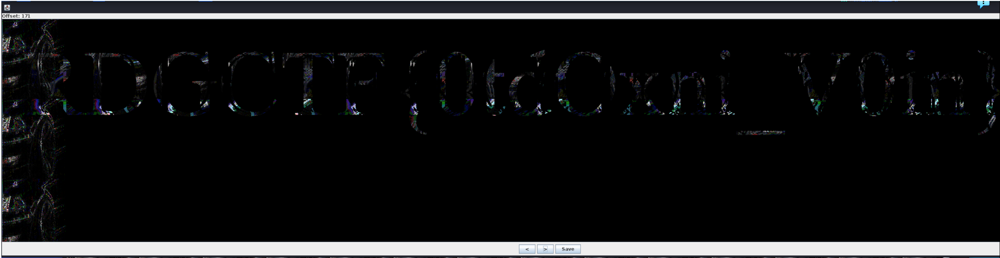

# EASY

Это задание для тебя, если ты вдруг устал, или только разминаешься, перед более серьезными вызовами!

# WriteUp
1)  восстановить первые биты в файле с изображением до формата png
2) с помощью стегслова перебрать стереокартинку и найти флаг

# Flag
RDGCTF{0tdOxni_V0in}