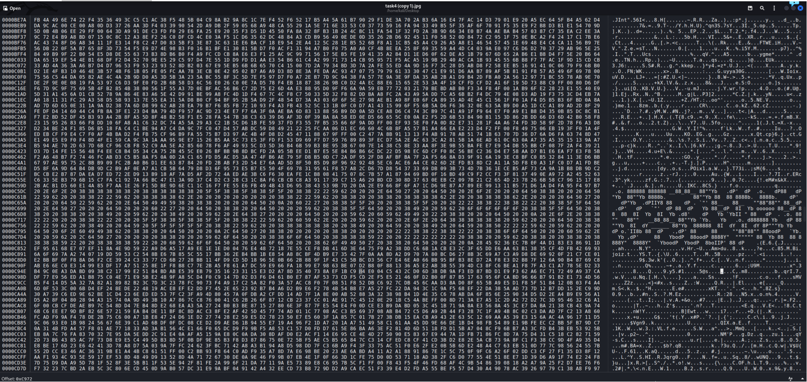

# KEKA
С КЕКОЙ ЧТО ТО ПРОИЗОШЛО!!!

# WriteUp
1)  Если открыть файл через хекс и долистать до середины, будет какая-то непонятная сигнатура

2)  Если ее скопировать и поместить в блокнот, то появится что то похожее на текст

3)  Если постараться, то можно переписать символы в текст, а именно:  **;FF#B<(;40Bd=rhDD60$I/**

4)  Закинув текст в **cyberchef**, можно получить флаг:
RDGCTF{Ni$$@n0tE}

**P.S.** Для усложнения задание содержит ложный флаг в 2х местах:
Flag: Y@_H@tsKe4

# Flag

RDGCTF{Ni$$@n0tE}