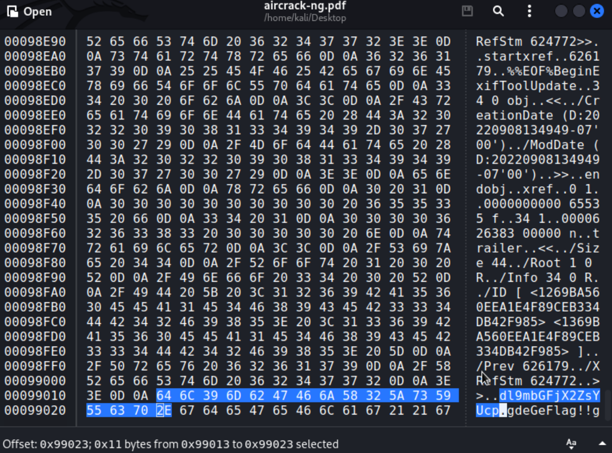

# Опять Mark II
Пройди длинный путь и познай стегу

# WriteUp
1)  Через binwalk достаем архив из картинки

2)  Находим подсказку в base64 в одном из файлов

3)  Декодируем подсказку через base64

4)  Через DeepSound достаем картинку

5)  Сканим QR

6)  Декодируем QR

# Flag
RDGCTF{4el_xh0RoG}