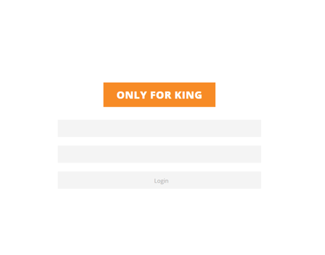
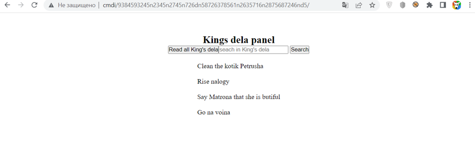
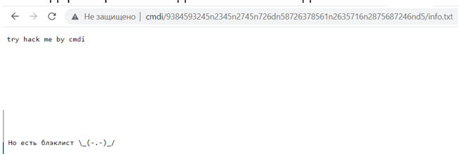

# KING

Я опять забыл какое было описание(

Так что будет следующее:
 Кажется Король опять все забыл...

# WriteUp
1.  В начале мы видим форму авторизации

Намек на то, что имя пользователя **king**

2.  Брутим формочку текстовиком **rockyou.txt** и находим пароль funkyprincess
 Заходим ин зе нутрь

Тут либо можно догадаться, что здесь уязвимость **CMDi**
  Либо можно профазить страницу и найти подсказку...
Да очень много брута, что поделать.

Вот собственно сама подсказка.

Возвращаемся к странице, где мы могли что-то искать

3.  Видим формочку возвращяющую какие-то данные, а при поиске выполняется что-то похожее на поиск по подстроке
Выполняем команды **%0A’l’s+-la**   - получаем список файлов из директории
Читаем файл **flag.txt** **%0A’c’at+flag.txt** 
4.  Получаем флаг 

# Flag
RDGCTF{0_Ti_can_Mad3_CMD1}