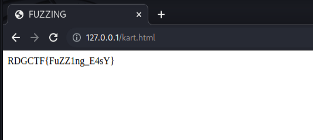

# Реквием по мечте

Кажется здесь есть еще одна страница!

## Hint
Словарь: directory-list-2.3-medium.txt
<br>(Есть в SecList)

# WriteUp

## Инструменты
[ffuf](https://portswigger.net/burp)

## Решение
Исходя из описания к таску, у нас имеется по соседству еще одна страница, а значит нам ее надо найти.

Так как в сорсах страницы ничего интересного нам нет, то сразу можно прибегнуть к фаззингу директорий и страниц.

Для фаззинга существует множество различных инструментов, я в свою очередь буду использовать утилиту [**ffuf**](https://github.com/ffuf/ffuf).

Сложностей здесь никаких возникнуть не должно, только стоит отметить, что ищем мы страницу, а значит при фаззинге нам надо указывать формат страницы, а так как он нам не известен, будем фаззить сразу несколько вариантов.

Естественно нам потребуется хороший словарь, воспользуемся стандартным **directory-list-2.3-medium.txt**

Большой сборник все-возможных словарей можно взять тут -> [SecList](https://github.com/danielmiessler/SecLists)

**Команда для фаззинга:**

```bash
┌──(kali㉿kali)-[~/RDG/html3]
└─$ ffuf -u http://127.0.0.1/FUZZ -w ~/Downloads/SecLists-master/Discovery/Web-Content/directory-list-2.3-medium.txt -e .txt,.webp,.html,.php -t 200 -mc all -c -fs 146
```
|**Параметры**|**Описание**|
|-------------|------------|
|-u|для указания URL адреса|
|-w|для указания пути к используемому словарю|
|-e|для указания форматов страниц|
|-t|для указания количества потоков|
|-mc|для указания кодов ответов "all" для всех кодов|
|-c|для включения подсветки|
|-fs|для фильтрации размеров ответов|

Запускаем фаззинг и ждем

```bash
┌──(kali㉿kali)-[~/RDG/html3]
└─$ ffuf -u http://127.0.0.1/FUZZ -w ~/Downloads/SecLists-master/Discovery/Web-Content/directory-list-2.3-medium.txt -e .txt,.webp,.html,.php -t 200 -mc all -c -fs 146

        /'___\  /'___\           /'___\       
       /\ \__/ /\ \__/  __  __  /\ \__/       
       \ \ ,__\\ \ ,__\/\ \/\ \ \ \ ,__\      
        \ \ \_/ \ \ \_/\ \ \_\ \ \ \ \_/      
         \ \_\   \ \_\  \ \____/  \ \_\       
          \/_/    \/_/   \/___/    \/_/       

       v1.5.0 Kali Exclusive <3
________________________________________________

 :: Method           : GET
 :: URL              : http://127.0.0.1/FUZZ
 :: Wordlist         : FUZZ: /home/kali/Downloads/SecLists-master/Discovery/Web-Content/directory-list-2.3-medium.txt
 :: Extensions       : .txt .webp .html .php 
 :: Follow redirects : false
 :: Calibration      : false
 :: Timeout          : 10
 :: Threads          : 200
 :: Matcher          : Response status: all
 :: Filter           : Response size: 146
________________________________________________

kart.html               [Status: 200, Size: 154, Words: 12, Lines: 10, Duration: 14ms]
[WARN] Caught keyboard interrupt (Ctrl-C)
```
Как видим мы нашли еще одну страницу на сайте, давайте попробуем перейти туда.



# Flag
RDGCTF{FuZZ1ng_E4sY}